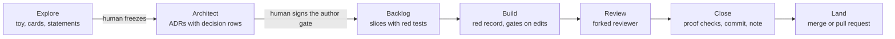
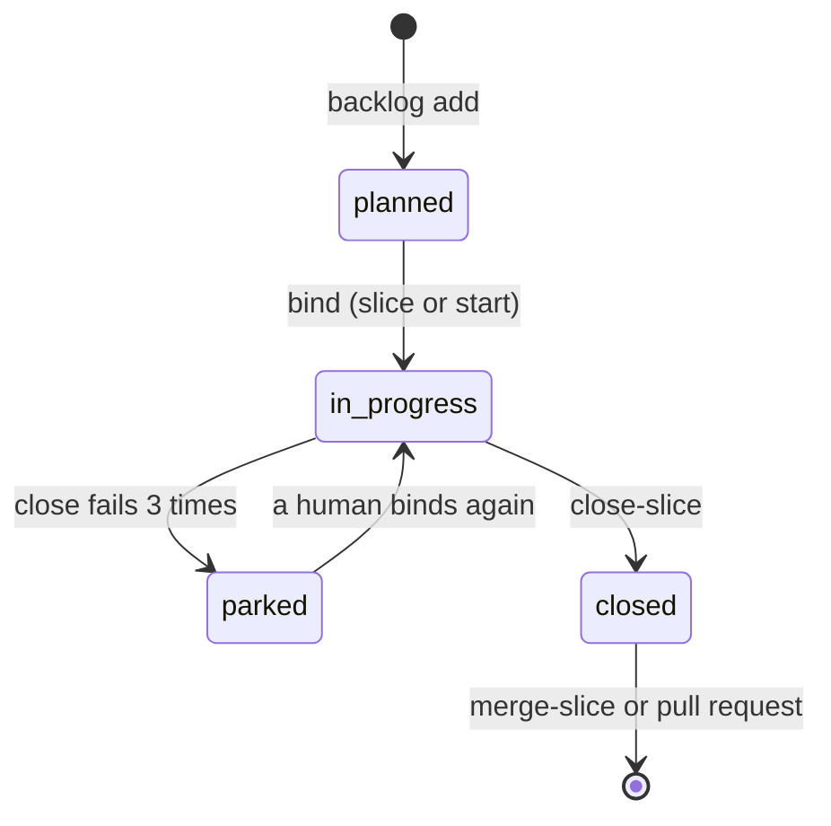

# Slice lifecycle

A slice is the smallest unit of autonomous work. This page follows a feature from the first idea to code on the base branch, and a slice through its states.

## From idea to landed code

A feature moves from a quick toy to merged code in seven steps.

A human runs `harness explore --freeze`. The freeze writes the human's git identity into `explore/DECISIONS.md` as `frozen_by`.

A human signs the author gate at the end of architect. The agent does the other steps.

A design can skip the toy. Then architect starts with `harness architect --skip-explore "<reason>"`, or with `--from-spec <path>` for an existing spec.

## Slice states

Each slice row in `.harness/backlog.jsonl` has a `status`. The engine knows four values, from `engine/schema.py`: `planned`, `in_progress`, `parked` and `closed`.

- A bind is `harness slice --slice <id>` or `harness start --slice <id>`. It sets `planned` and `parked` slices to `in_progress`.
- `close-slice` counts each close that fails on a real problem. At `run.max_close_attempts` failures (default 3), it sets the slice to `parked` and records `parked_reason`.
- A parked slice cannot close. A human reads `parked_reason`, then binds the slice again to unpark it.
- A close that fails on a guard, such as a slice that is already closed, does not count.
- A closed slice cannot be bound again.

A closed slice can also carry `landed_via`. The schema allows `local`, `pr` and `pending`. Pull request mode writes `pr` when the landing worked and `pending` when it failed.

## What each transition checks

| Transition | Command | What harness checks | What it writes |
|---|---|---|---|
| Add a slice | `harness backlog add` | the id is new; each `--declares` id is in the registry; `--acceptance` is given; each `--verifies` id is in `.harness/verify.jsonl`; `--linear` looks like `GOO-73` | one row in `.harness/backlog.jsonl` with `status: planned` and `context_cost_estimate` |
| Bind | `harness start --slice <id>` or `harness slice --slice <id>` | the slice is not closed; each `depends_on` slice is closed, or `--force` with `--justification`; the `acceptance` config is valid | `start` only: worktree `.worktrees/<id>` on branch `slice/<id>` and a sandbox profile. Both: the binding, `in_progress`, `started_at_commit`, the G6 baseline, the red record |
| Edit | host hooks | G1, G3 and G10 before the edit; G5 and G9 after it; one red-record advisory | findings; a block before the edit stops it, and a block after the edit reports it |
| End of turn | Stop hook | G5, G6, G9 and repo-local gates at `unit_complete` | findings; a block stops the turn once |
| Close | `harness close-slice --slice <id> --commit HEAD` | the checks on the [Close](../workflow/close.md) page | a substrate commit, a git note under `refs/notes/harness`, one `slice-metrics.jsonl` row, `status: closed` |
| Land | `harness merge-slice` (local mode) or the close itself (pull request mode) | local mode: acceptance, `gate_cmd` and `unit_complete` gates on the merged tree | local mode: a merge and a substrate commit. Pull request mode: a push and a pull request |

## Events and gates

The engine has five events:

1. `session_start`: a session starts.
2. `pre_context`: the user sends a prompt.
3. `pre_change`: an edit is about to happen.
4. `post_change`: an edit happened.
5. `unit_complete`: a turn ends, and close and merge run it too.

Each gate declares `preferred` events and `fallback` events. Some hosts cannot stop an edit before it lands. For them, set `gates.degraded_mode: true`, and the engine also runs each gate at its fallback events. The builtin gates are G1, G3, G5, G6, G9 and G10.

| Gate | Preferred events | Fallback events |
|---|---|---|
| G1 | `session_start`, `pre_change` | `post_change` |
| G3 | `pre_change` | `post_change` |
| G5 | `post_change`, `unit_complete` | none |
| G6 | `unit_complete` | none |
| G9 | `post_change`, `unit_complete` | none |
| G10 | `pre_change` | `post_change` |

[Gates](../reference/gates.md) lists each gate in full. [Hook events](../reference/hooks.md) maps each host hook to an engine event.

## Parks and adjudication

A reviewer that is not sure about a blocking finding parks it. It does not guess. The finding goes into `.harness/parked.jsonl`. A slice with an open park cannot close.

A human resolves each park in the main session, through `/harness:harness` and `harness adjudicate`. The forked reviewer never adjudicates.

- `harness adjudicate --list` shows the parked findings.
- Each resolution writes an adjudication edge to `.harness/edges.jsonl`.
- A recurring question also writes a decision row: pass `--decision-id` and `--domain`.
- For a one-off ruling, the output suggests a `harness memory promote --text` command. The human decides whether to run it.

A question that a human already decided does not park again. The review shows the precedent as an advisory finding.
