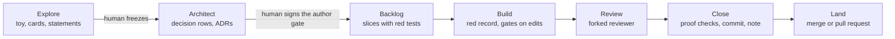
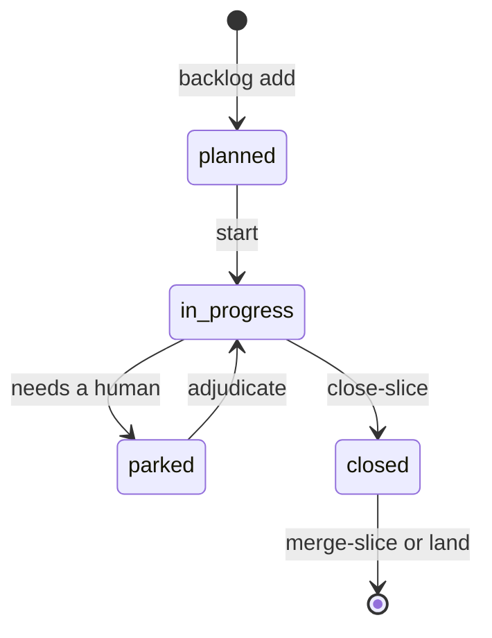
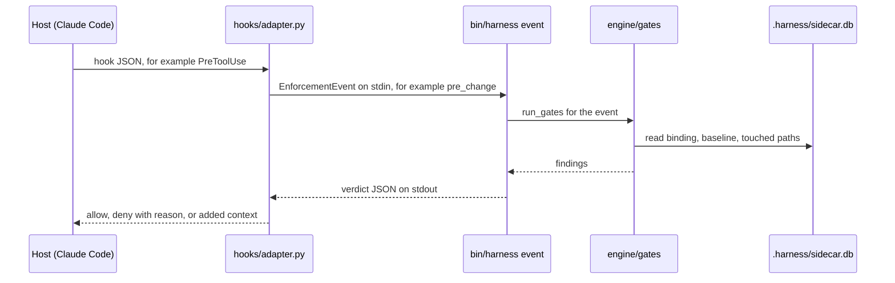

# W7 Docs site Implementation Plan

> **For agentic workers:** REQUIRED SUB-SKILL: Use superpowers:subagent-driven-development (recommended) or superpowers:executing-plans to implement this plan task-by-task. Steps use checkbox (`- [ ]`) syntax for tracking.

**Goal:** Publish one mkdocs-material website that tells a technical reader what harness does, what it does not do, and how to change it, with Reference pages generated from the code.

**Architecture:** `docs/` becomes the site source. Design history moves to `docs/internal/`, and the site excludes it. An mkdocs hook (`docs/hooks/reference.py`) generates the Reference pages and the Changelog page from the argparse parser, the gate modules, `DEFAULT_CONFIG` and the config template, the finding catalog, `hooks/hooks.json` and `engine/schema.py`. A GitHub Actions workflow lints the text with `harness lint-text`, builds with `--strict`, and deploys to GitHub Pages only on `peekwez/harness`. README shrinks to a pitch, install, quick start and link. The changelog moves to `CHANGELOG.md`.

**Tech Stack:** Python 3.10+, mkdocs 1.6.1, mkdocs-material 9.7.7, pymdown-extensions 12.1 (mermaid through `pymdownx.superfences`), pytest, GitHub Actions (`actions/upload-pages-artifact`, `actions/deploy-pages`).

**Spec:** `docs/superpowers/specs/2026-10-02-harness-0.10-design.md` (Task 1 moves it to `docs/internal/superpowers/specs/2026-10-02-harness-0.10-design.md`). Sections 11, 10.4, D-0.10-04 and D-0.10-13 are this plan's. The whole spec is the content source for the site. Plans index: `docs/superpowers/plans/2026-10-02-harness-0.10-index.md` (moves with it).

## Global Constraints

- W1 to W6 are merged exactly as the plans index says. Builtin gates are G1, G3, G5, G6, G9. `engine/findings.py` `CATALOG`, `engine/lint_text.py` `lint_paths(paths, glossary)` and `harness lint-text <paths>` exist.
- Assumption about W4: `harness lint-text <paths>` reads `<root>/docs/glossary.md` when that file exists. Task 9 runs the real CI command, so a wrong assumption fails a test.
- Site URL: `https://peekwez.github.io/harness/`. Repo URL: `https://github.com/peekwez/harness`.
- Every job in `.github/workflows/docs.yml` has `if: github.repository == 'peekwez/harness'` (D-0.10-04: the origin push also reaches goodwork-eng).
- Pins in `docs/requirements.txt`: `mkdocs==1.6.1`, `mkdocs-material==9.7.7`, `pymdown-extensions==12.1`, `pyyaml==6.0.3`.
- `mkdocs build --strict` passes. `docs/internal/` is never published.
- Reference pages are generated at build time (D-0.10-13). Nobody writes `docs/reference/*.md` or `docs/changelog.md` by hand.
- STE-80 for all site text and README (spec 9.1): short sentences (25 words or fewer in steps, list items and messages; 35 in prose); one action per step; active voice with a named subject; one name per concept, from the glossary.
- Banned words (spec 9.3 examples, W4 list): utilize, leverage, simply, robust, "in order to". Do not use them in site text.
- README.md is under 300 lines. It holds the pitch, install, quick start and the site link (spec 10.4).
- `CHANGELOG.md` holds the changelog from README, with an empty `## 0.10.0 (unreleased)` heading that W8 fills.
- W7 changes no consumer-visible substrate, so W7 registers no upgrade step in `engine/upgrade_010.py`.
- Skills and templates name `docs/design-reviews/` and `docs/superpowers/specs/` as paths in a **consumer** repo. Those are conventions, not links to this repo's files. Do not change them.
- Tests use `tests/conftest.py` (`PLUGIN_ROOT`, `run_cli`, `git`). Run with `python3 -m pytest tests/ -q`.
- Commit messages end with `Co-Authored-By: Claude Opus 5.5 <noreply@anthropic.com>`.

## Review Focus

1. **Stale command or skill names in prose.** A page or README names `harness run`, `harness memory write` or `/harness:status` after W2/W3 removed them. Expected: a test fails and names the file and line. Pinned by `test_public_docs_name_real_commands` and `test_public_docs_name_real_skills` (Task 4, README added in Task 8).
2. **Internal folders come back.** The superpowers plan skill saves to `docs/superpowers/plans/` and the design-review skill writes `docs/design-reviews/`. A future run in this repo recreates them. Expected: the site still does not publish them. Pinned by `test_internal_folders_are_excluded` and the strict-build test that checks `site/` (Task 7).
3. **A hand-written file at a generated path.** Someone adds `docs/reference/cli.md`. Expected: the build fails and names the file; it never silently replaces the generated page. Pinned by `test_hand_written_reference_page_is_refused` (Task 7).
4. **Help text that breaks a table.** argparse help with `%(default)s`, `%%`, or a `|` character. Expected: the default value appears, `%%` becomes `%`, and a pipe is escaped. Pinned by `test_table_cells_escape_pipes` and `test_help_with_percent_default_is_formatted` (Task 2).
5. **Glossary synonyms collide with existing text.** A `not:` word in `docs/glossary.md` appears in a public page, so CI fails after the glossary lands. Expected: every public page passes `lint_paths` with the glossary. Pinned by `test_every_public_page_passes_lint_text` (Task 7) and the grep step in Task 6.

---

## File Structure

| Path | Action | Responsibility |
|---|---|---|
| `docs/internal/` | create (moves) | design reviews, specs, plans, `SPEC.md`, the Codex Astra handoff; excluded from the site |
| `CHANGELOG.md` | create | release history moved out of README |
| `engine/cli/__init__.py` | modify | extract `build_parser()` so the hook can read the parser |
| `docs/hooks/reference.py` | create | mkdocs hook; `build_pages(root)` returns generated pages |
| `docs/hooks/file-formats.md` | create | hand-written part of the File formats page (excluded from the site; the hook reads it) |
| `docs/index.md`, `docs/trade-offs.md` | create | Home and Trade-offs, full text |
| `docs/concepts/*.md`, `docs/workflow/*.md`, `docs/verification.md`, `docs/decision-cards.md`, `docs/memory.md` | create | concept and workflow pages |
| `docs/extending/*.md`, `docs/internals.md`, `docs/upgrading.md` | create | contributor and upgrade pages |
| `docs/glossary.md` | create | harness's own glossary in W4 format |
| `mkdocs.yml`, `docs/requirements.txt`, `.gitignore` | create/modify | site config, pinned deps, ignore `site/` |
| `.github/workflows/docs.yml` | create | lint, strict build, Pages deploy |
| `README.md` | rewrite | under 300 lines |
| `tests/engine/test_docs_reference.py` | create | generated reference tests |
| `tests/engine/test_docs_site.py` | create | page structure, lint, names, config, workflow, README tests |
| `tests/engine/test_internal_paths.py` | create | no stale reference to a moved file |
| `tests/engine/test_review_fixes.py`, `test_final_review_wave.py`, `test_plugin_root_agnostic.py`, `test_codex_astra_wave1.py`, `test_vendored_engine.py`, `test_superpowers_composition.py` | modify | point README-content tests at the site and CHANGELOG |

---

### Task 1: Move internal documents and create CHANGELOG.md

**Files:**
- Move: `docs/design-reviews/` → `docs/internal/design-reviews/`
- Move: `docs/superpowers/` → `docs/internal/superpowers/` (this plan file moves too)
- Move: `docs/SPEC.md` → `docs/internal/SPEC.md`
- Move: `CODEX-ASTRA-HARNESS-ENHANCEMENTS.md` → `docs/internal/handoffs/2026-09-05-codex-astra-harness-enhancements.md`
- Modify: `adr/003-finding-records-review-snapshots-decision-lifecycle.md:26`
- Modify: `docs/internal/superpowers/plans/2026-10-02-harness-0.10-index.md:3`
- Modify: `tests/engine/test_review_fixes.py:167`
- Modify: `tests/engine/test_final_review_wave.py:310-320`
- Create: `CHANGELOG.md`
- Test: `tests/engine/test_internal_paths.py`

**Decisions in this task:**
- `docs/SPEC.md` moves to `docs/internal/SPEC.md`. It is a marker table for skill authors (`§5.6`, `C7`, `T1`), not reader documentation. Its text describes 0.9 internals (G1–G8, token budget). The marker test keeps working at the new path.
- The Codex Astra file goes to `docs/internal/handoffs/2026-09-05-codex-astra-harness-enhancements.md`. ADR-003 line 26 already cites `docs/handoffs/2026-09-05-codex-astra-harness-enhancements.md`, which does not exist today. The new name makes that citation resolve after one path fix.
- `docs/handoffs/` has no tracked files. Nothing moves from it.

**Interfaces:**
- Consumes: nothing.
- Produces: `CHANGELOG.md` with `# Changelog`, then `## 0.10.0 (unreleased)` (empty), then `## 0.9.4 — …` down to `## 0.8.0`. Task 2 reads it into the `changelog.md` page. W8 fills the 0.10.0 section.

- [ ] **Step 1: Write the failing test**

Create `tests/engine/test_internal_paths.py`:

```python
"""W7: design history lives in docs/internal/ and no file points at the old
paths. Skills and templates may still name docs/design-reviews/ and
docs/superpowers/specs/ — those are paths in a CONSUMER repo, not links."""
import subprocess

from conftest import PLUGIN_ROOT

GONE = ("docs/SPEC.md", "CODEX-ASTRA-HARNESS-ENHANCEMENTS.md",
        "docs/handoffs/")
# Paths that only harness's own code and tests used. Skills, templates,
# agents and the public docs pages name them as consumer-repo conventions,
# and docs.yml / mkdocs.yml name them to exclude them, so only these
# locations are checked for them.
OWN_ONLY = ("docs/design-reviews/", "docs/superpowers/")
OWN_SCOPE = ("tests/", "engine/", "bin/", "hooks/", "adr/", ".harness/")
OWN_FILES = ("README.md", "CHANGELOG.md", "Makefile")
SELF = "tests/engine/test_internal_paths.py"


def _tracked():
    out = subprocess.run(["git", "-C", str(PLUGIN_ROOT), "ls-files"],
                         capture_output=True, text=True, check=True).stdout
    return [p for p in out.splitlines()
            if not p.startswith("docs/internal/") and p != SELF]


def test_moved_files_exist_at_their_new_paths():
    internal = PLUGIN_ROOT / "docs" / "internal"
    assert (internal / "SPEC.md").is_file()
    assert (internal / "handoffs"
            / "2026-09-05-codex-astra-harness-enhancements.md").is_file()
    assert (internal / "design-reviews").is_dir()
    assert (internal / "superpowers" / "specs"
            / "2026-10-02-harness-0.10-design.md").is_file()
    for old in ("docs/SPEC.md", "docs/design-reviews", "docs/superpowers",
                "CODEX-ASTRA-HARNESS-ENHANCEMENTS.md"):
        assert not (PLUGIN_ROOT / old).exists(), old


def test_no_tracked_file_points_at_a_moved_path():
    stale = []
    for rel in _tracked():
        path = PLUGIN_ROOT / rel
        if path.suffix not in {".md", ".py", ".yml", ".yaml", ".json",
                               ".toml", ".txt", ".sh"}:
            continue
        text = path.read_text(errors="replace")
        for needle in GONE:
            if needle in text:
                stale.append(f"{rel}: {needle}")
        if rel.startswith(OWN_SCOPE) or rel in OWN_FILES:
            for needle in OWN_ONLY:
                if needle in text:
                    stale.append(f"{rel}: {needle}")
    assert not stale, "stale paths:\n" + "\n".join(stale)


def test_changelog_has_an_empty_0_10_heading_first():
    text = (PLUGIN_ROOT / "CHANGELOG.md").read_text()
    lines = text.splitlines()
    assert lines[0] == "# Changelog"
    headings = [ln for ln in lines if ln.startswith("## ")]
    assert headings[0] == "## 0.10.0 (unreleased)"
    assert headings[1].startswith("## 0.9.4")
    assert headings[-1] == "## 0.8.0"
    assert not any(ln.startswith("### 0.") for ln in lines)
```

- [ ] **Step 2: Run the test to verify it fails**

Run: `python3 -m pytest tests/engine/test_internal_paths.py -v`
Expected: FAIL. `test_moved_files_exist_at_their_new_paths` fails on `docs/internal/SPEC.md`; the changelog test fails with `FileNotFoundError: CHANGELOG.md`.

- [ ] **Step 3: Move the files**

```bash
cd /Users/kwesi/Desktop/biz-apps/harness
mkdir -p docs/internal/handoffs
git mv docs/design-reviews docs/internal/design-reviews
git mv docs/superpowers docs/internal/superpowers
git mv docs/SPEC.md docs/internal/SPEC.md
git mv CODEX-ASTRA-HARNESS-ENHANCEMENTS.md \
  docs/internal/handoffs/2026-09-05-codex-astra-harness-enhancements.md
git status --short docs/ | grep -v '^R ' || true
```

Expected: the last command prints nothing. From now on this plan is at `docs/internal/superpowers/plans/2026-10-02-harness-0.10-w7-docs-site.md`.

- [ ] **Step 4: Fix the references**

In `adr/003-finding-records-review-snapshots-decision-lifecycle.md` line 26, replace
`docs/handoffs/2026-09-05-codex-astra-harness-enhancements.md` with
`docs/internal/handoffs/2026-09-05-codex-astra-harness-enhancements.md`.

In `docs/internal/superpowers/plans/2026-10-02-harness-0.10-index.md` line 3, replace
`` `docs/superpowers/specs/2026-10-02-harness-0.10-design.md` `` with
`` `docs/internal/superpowers/specs/2026-10-02-harness-0.10-design.md` ``. Add this line under the bullet list at the top:

```markdown
- W7 moved `docs/superpowers/` to `docs/internal/superpowers/`. Plan files are now in `docs/internal/superpowers/plans/`.
```

In `tests/engine/test_review_fixes.py`, change the glossary path:

```python
    glossary = (PLUGIN_ROOT / "docs" / "internal" / "SPEC.md").read_text()
```

and the failure message on line 173 to `f"docs/internal/SPEC.md does not define: {missing}"`.

In `docs/internal/SPEC.md` nothing changes. Its own text names the test, not its path.

Then find any other hit:

```bash
git grep -n -E "docs/SPEC\.md|CODEX-ASTRA-HARNESS|docs/handoffs/" -- . ':!docs/internal' ':!tests/engine/test_internal_paths.py'
git grep -n -E "docs/(design-reviews|superpowers)/" -- tests engine bin hooks adr .harness README.md CHANGELOG.md Makefile ':!tests/engine/test_internal_paths.py'
```

Expected hits: only `README.md` (lines near 292, 346, 700). Task 8 rewrites README. Until then, edit those three README lines to the new paths so the test passes:
`docs/SPEC.md` → `docs/internal/SPEC.md` (two places), `docs/design-reviews/` → `docs/internal/design-reviews/` (one place). Fix any other hit the same way.

- [ ] **Step 5: Create CHANGELOG.md from README**

```bash
cd /Users/kwesi/Desktop/biz-apps/harness
python3 - <<'EOF'
from pathlib import Path
lines = Path("README.md").read_text().splitlines()
start = lines.index("## Changelog")
out = ["# Changelog", "",
       "Newest release first. Each heading is one release.", "",
       "## 0.10.0 (unreleased)", ""]
for line in lines[start + 1:]:
    out.append(line[1:] if line.startswith("###") else line)
Path("CHANGELOG.md").write_text("\n".join(out).rstrip() + "\n")
EOF
head -12 CHANGELOG.md
```

Expected: `# Changelog`, the one-line intro, `## 0.10.0 (unreleased)`, then `## 0.9.4 — verification design and live execution coverage`.

Do not delete the README changelog yet. Task 8 rewrites README.

- [ ] **Step 6: Point the changelog test at CHANGELOG.md**

In `tests/engine/test_final_review_wave.py`, replace `test_the_readme_changelogs_the_release` with:

```python
def test_the_changelog_records_the_release():
    from pathlib import Path

    import engine
    changelog = (Path(engine.__file__).resolve().parents[1]
                 / "CHANGELOG.md").read_text()
    assert changelog.startswith("# Changelog")
    assert "## 0.8.0" in changelog
    for issue in ("GOO-73", "GOO-74", "GOO-75", "GOO-76", "GOO-77", "GOO-78",
                  "GOO-79"):
        assert issue in changelog, issue
```

- [ ] **Step 7: Run the tests**

Run: `python3 -m pytest tests/engine/test_internal_paths.py tests/engine/test_review_fixes.py tests/engine/test_final_review_wave.py -q`
Expected: PASS.

- [ ] **Step 8: Commit**

```bash
# git mv already staged the moves and the root file's removal
git add -A docs adr/003-finding-records-review-snapshots-decision-lifecycle.md README.md CHANGELOG.md \
  tests/engine/test_internal_paths.py tests/engine/test_review_fixes.py tests/engine/test_final_review_wave.py
git status --short   # expect only the new docs/superpowers/... -> docs/internal/... renames and the files above
git commit -m "docs: move design history to docs/internal and create CHANGELOG.md

Co-Authored-By: Claude Opus 5.5 <noreply@anthropic.com>"
```

---

### Task 2: Generated reference hook

**Files:**
- Modify: `engine/cli/__init__.py` (extract `build_parser()` from `main`)
- Create: `docs/hooks/reference.py`
- Create: `docs/hooks/file-formats.md`
- Test: `tests/engine/test_docs_reference.py`

**Interfaces:**
- Consumes: `engine.cli.COMMANDS`; `engine.gates.builtin_gates() -> list[module]` (each module has `GATE: dict` and a module docstring); `engine.DEFAULT_CONFIG: dict`; `templates/harness.yaml`; `engine.findings.CATALOG: dict[str, str]` (W4); `engine.events.EVENTS: tuple[str, ...]`; `engine.schema.SCHEMAS: dict[str, dict]`; `hooks/hooks.json`; `hooks/adapter.py` `EVENT_MAP: dict[str, str]`; `CHANGELOG.md` (Task 1).
- Produces:
  - `engine.cli.build_parser() -> argparse.ArgumentParser` (prog `harness`). `main(argv)` calls it.
  - `docs/hooks/reference.py`:
    - `build_pages(root: Path) -> dict[str, str]` with keys `reference/cli.md`, `reference/gates.md`, `reference/config.md`, `reference/findings.md`, `reference/hooks.md`, `reference/file-formats.md`, `changelog.md`.
    - `GENERATED_PAGES: tuple[str, ...]` — those seven keys.
    - `on_files(files, config)` — the mkdocs hook entry point.
    - helpers used by tests: `_table(header, rows) -> str`, `_arguments(parser) -> list[list[str]]`, `iter_commands(parser, prefix="harness")` yields `(full_name, help, subparser)`.

- [ ] **Step 1: Write the failing tests**

Create `tests/engine/test_docs_reference.py`:

```python
"""D-0.10-13: the Reference pages come from the code, so they cannot drift.
Removing a gate removes it from the gates page in the same PR."""
import argparse
import importlib.util
import inspect
import json

import pytest

from conftest import PLUGIN_ROOT

HOOK = PLUGIN_ROOT / "docs" / "hooks" / "reference.py"


@pytest.fixture(scope="module")
def hook():
    spec = importlib.util.spec_from_file_location("docs_reference_hook", HOOK)
    mod = importlib.util.module_from_spec(spec)
    spec.loader.exec_module(mod)
    return mod


@pytest.fixture(scope="module")
def pages(hook):
    return hook.build_pages(PLUGIN_ROOT)


def _flatten(d, prefix=""):
    for key, value in d.items():
        if isinstance(value, dict) and value:
            yield from _flatten(value, f"{prefix}{key}.")
        else:
            yield f"{prefix}{key}"


def test_build_parser_covers_the_dispatch_table():
    from engine.cli import COMMANDS, build_parser
    parser = build_parser()
    assert parser.prog == "harness"
    sub = next(a for a in parser._actions
               if isinstance(a, argparse._SubParsersAction))
    assert set(sub.choices) == set(COMMANDS)


def test_build_pages_returns_every_generated_page(hook, pages):
    assert set(pages) == set(hook.GENERATED_PAGES)
    for name, text in pages.items():
        assert text.startswith("# "), name


def test_cli_page_lists_every_subcommand(pages):
    from engine.cli import COMMANDS
    page = pages["reference/cli.md"]
    missing = [c for c in COMMANDS if f"`harness {c}`" not in page]
    assert not missing, f"CLI reference lacks: {missing}"


@pytest.mark.parametrize("nested", [
    "gates override", "gates ack-drift", "gates explain", "backlog add",
    "registry refresh", "memory promote", "graph note"])
def test_cli_page_lists_nested_subcommands(pages, nested):
    assert f"`harness {nested}`" in pages["reference/cli.md"]


def test_cli_page_documents_options(pages):
    page = pages["reference/cli.md"]
    assert "`--root`" in page
    assert "`--dry-run`" in page


def test_gates_page_lists_every_builtin_gate_and_no_removed_gate(pages):
    from engine.gates import builtin_gates
    page = pages["reference/gates.md"]
    ids = {g.GATE["id"] for g in builtin_gates()}
    assert ids == {"G1", "G3", "G5", "G6", "G9"}
    for gid in ids:
        assert f"\n## {gid}\n" in page, gid
    for gone in ("G2", "G4", "G7", "G8"):
        assert f"## {gone}\n" not in page, gone


def test_gates_page_carries_each_module_docstring(pages):
    from engine.gates import builtin_gates
    page = pages["reference/gates.md"]
    for gate in builtin_gates():
        first = inspect.getdoc(gate).splitlines()[0]
        assert " ".join(first.split()).replace("|", "\\|") in page, first


def test_config_page_lists_every_default_key(pages):
    from engine import DEFAULT_CONFIG
    page = pages["reference/config.md"]
    missing = [k for k in _flatten(DEFAULT_CONFIG) if f"`{k}`" not in page]
    assert not missing, missing
    assert "```yaml" in page   # the annotated template


def test_findings_page_lists_every_catalog_code(pages):
    from engine.findings import CATALOG
    assert CATALOG
    page = pages["reference/findings.md"]
    missing = [c for c in CATALOG if f"`{c}`" not in page]
    assert not missing, missing


def test_hooks_page_lists_every_host_and_engine_event(pages):
    from engine.events import EVENTS
    hooks = json.loads((PLUGIN_ROOT / "hooks" / "hooks.json").read_text())
    page = pages["reference/hooks.md"]
    for name in hooks["hooks"]:
        assert f"`{name}`" in page, name
    for name in EVENTS:
        assert f"`{name}`" in page, name


def test_file_formats_page_lists_each_schema_field(pages):
    from engine.schema import SCHEMAS
    page = pages["reference/file-formats.md"]
    assert "`.harness/verify.jsonl`" in page
    for filename, spec in SCHEMAS.items():
        assert f"`.harness/{filename}`" in page
        for field, _type, _required in spec["fields"]:
            assert f"`{field}`" in page, (filename, field)


def test_changelog_page_is_the_changelog_file(pages):
    assert pages["changelog.md"] == (PLUGIN_ROOT / "CHANGELOG.md").read_text()


def test_table_cells_escape_pipes(hook):
    table = hook._table(["a"], [["x|y"]]).splitlines()
    assert table[2] == "| x\\|y |"


def test_help_with_percent_default_is_formatted(hook):
    parser = argparse.ArgumentParser(prog="t")
    parser.add_argument("--doc", default="docs/a.md",
                        help="doc (default: %(default)s)")
    parser.add_argument("base", help="driver (%%O %%A %%B)")
    helps = [row[-1] for row in hook._arguments(parser)]
    assert "doc (default: docs/a.md)" in helps
    assert "driver (%O %A %B)" in helps
```

- [ ] **Step 2: Run the tests to verify they fail**

Run: `python3 -m pytest tests/engine/test_docs_reference.py -v`
Expected: FAIL. The fixture raises `FileNotFoundError` for `docs/hooks/reference.py`; `test_build_parser_covers_the_dispatch_table` fails with `ImportError: cannot import name 'build_parser'`.

- [ ] **Step 3: Extract `build_parser()`**

In `engine/cli/__init__.py`:

1. Change `__all__ = ["COMMANDS", "main"]` to `__all__ = ["COMMANDS", "build_parser", "main"]`.
2. Rename `def main(argv=None):` to `def build_parser() -> argparse.ArgumentParser:` and add this docstring as its first line:
   `"""The `harness` argparse parser. The docs hook reads it for the CLI reference."""`
3. Replace the tail of that function (from `args = p.parse_args(argv)` to the end) with `return p`.
4. Add a new `main` after it:

```python
def main(argv=None):
    p = build_parser()
    args = p.parse_args(argv)
    try:
        return COMMANDS[args.cmd](args)
    except HarnessError as exc:
        print(json.dumps({"error": str(exc)}), file=sys.stderr)
        return 1
```

Run: `python3 -m pytest tests/engine/test_cli_split.py tests/engine/test_docs_reference.py::test_build_parser_covers_the_dispatch_table -q`
Expected: PASS.

- [ ] **Step 4: Write `docs/hooks/file-formats.md`**

This file is the hand-written part of the File formats page. The site excludes `docs/hooks/`; the hook prepends it to the generated schema tables.

First, find the command that writes the red record (W5). Run:

```bash
grep -rn "verification" engine/cli/slice.py engine/cli/author.py | head
python3 bin/harness slice --help
```

Write that command's exact spelling where the text below says `harness slice --slice <slice>`. The spec (6.3) uses that spelling.

`````markdown
harness keeps its state in plain files. This page lists the format of each file that a person or a tool reads. The tables at the end come from `engine/schema.py`.

## `.harness/verify.jsonl`

`compile` writes one row for each statement. A row has four fields:

- `id`: the statement id, such as `V-orders-3`. It matches `V-[a-z0-9-]+-[0-9]+`.
- `feature`: the feature part of the id, such as `orders`.
- `statement`: the claim, in one sentence.
- `source`: the file that holds the statement, such as `explore/VERIFY.md`.

## Test links

A test links to a statement with a comment, in any comment syntax:

```python
# verifies: V-orders-3  kills: commit happens before the rollback check
def test_rollback_leaves_no_event_row(): ...
```

- `verifies:` names one or more statement ids, separated by commas.
- `kills:` names the bug that the test must catch. harness records it and does not run it.

## `.harness/verification/<slice>.json`

This file is the red record. `harness slice --slice <slice>` writes it when it runs the acceptance suite of the slice. The file is committed.

- `slice`, `commit`, `ran_at`: which slice, at which commit, at what time.
- `exit_code`: the exit code of the acceptance suite. It must not be zero.
- `output_tail`: the last lines of the suite output.
- `per_test`: the result of each test. It exists only with `acceptance.junit: true`.
- `green_at_start`: `true` when the suite passed at start. Close then needs an override with a reason.

## `.harness/slice-metrics.jsonl`

Close writes one committed row for each slice. A row holds the gates that fired, the overrides, the maximum injection size, the compaction count, `red_before_green`, `green_at_start` and, when explore was skipped, `explore_skipped`.

## `explore/DECISIONS.md`

This file holds the decision cards. The format is on the [Decision cards](../decision-cards.md) page. `harness explore --freeze` adds `frozen_by` and `frozen_at_commit` to its front matter.

## `.harness/cache/`

git ignores this folder. `shadows/` holds one shadow for each source file in scope. `events.jsonl` holds the local event rows.
`````

- [ ] **Step 5: Write `docs/hooks/reference.py`**

```python
"""mkdocs hook: generate the Reference pages and the Changelog from code.

D-0.10-13: the reference cannot drift. mkdocs calls `on_files`, which adds
one generated page for each entry of `build_pages`. Tests call
`build_pages` directly, so they do not need mkdocs installed.
"""
from __future__ import annotations

import argparse
import importlib.util
import inspect
import json
import sys
from pathlib import Path

REPO_ROOT = Path(__file__).resolve().parents[2]
GENERATED_PAGES = (
    "reference/cli.md", "reference/gates.md", "reference/config.md",
    "reference/findings.md", "reference/hooks.md",
    "reference/file-formats.md", "changelog.md",
)
NOTE = ("<!-- Generated by docs/hooks/reference.py at build time. "
        "Change the code, not this page. -->\n")
ARG_HEADER = ["Argument", "Required", "Default", "Choices", "Help"]


def _cell(value) -> str:
    return " ".join(str(value).split()).replace("|", "\\|")


def _table(header: list, rows: list) -> str:
    out = ["| " + " | ".join(header) + " |", "|" + "---|" * len(header)]
    out += ["| " + " | ".join(_cell(c) for c in row) + " |" for row in rows]
    return "\n".join(out) + "\n"


def _page(title: str, *parts: str) -> str:
    return "\n".join([f"# {title}\n", NOTE, *parts]).rstrip() + "\n"


# ------------------------------------------------------------------ CLI
def _subparser_action(parser):
    for action in parser._actions:
        if isinstance(action, argparse._SubParsersAction):
            return action
    return None


def iter_commands(parser, prefix="harness"):
    """Yield (full name, help, subparser) for each subcommand, depth first."""
    action = _subparser_action(parser)
    if action is None:
        return
    helps = {a.dest: a.help or "" for a in action._choices_actions}
    for name, child in action.choices.items():
        full = f"{prefix} {name}"
        yield full, helps.get(name, ""), child
        yield from iter_commands(child, full)


def _help(action) -> str:
    if not action.help or action.help == argparse.SUPPRESS:
        return ""
    try:
        return action.help % {"default": action.default, "prog": ""}
    except (KeyError, TypeError, ValueError):
        return action.help


def _arguments(parser) -> list:
    rows = []
    for a in parser._actions:
        if isinstance(a, (argparse._HelpAction, argparse._SubParsersAction)):
            continue
        name = ", ".join(a.option_strings) or a.dest
        default = a.default
        if default in (None, False, [], argparse.SUPPRESS):
            default = ""
        choices = ", ".join(map(str, a.choices)) if a.choices else ""
        rows.append([f"`{name}`", "yes" if a.required else "no",
                     default, choices, _help(a)])
    return rows


def render_cli(parser) -> str:
    parts = [_cell(parser.description or "") + "\n",
             "## Global options\n", _table(ARG_HEADER, _arguments(parser))]
    for full, help_text, child in iter_commands(parser):
        level = "#" * min(full.count(" ") + 1, 4)
        parts.append(f"{level} `{full}`\n")
        if help_text:
            parts.append(_cell(_help_text(help_text)) + "\n")
        parts.append("```text\n" + child.format_usage().strip() + "\n```\n")
        rows = _arguments(child)
        if rows:
            parts.append(_table(ARG_HEADER, rows))
    return _page("CLI reference", *parts)


def _help_text(text: str) -> str:
    try:
        return text % {}
    except (KeyError, TypeError, ValueError):
        return text


# ---------------------------------------------------------------- gates
def render_gates(gates) -> str:
    parts = ["Each builtin gate is one module in `engine/gates/`. "
             "This page shows each module's docstring and its `GATE` "
             "declaration.\n"]
    for gate in gates:
        decl = gate.GATE
        doc = inspect.getdoc(gate) or ""
        title, _, body = doc.partition("\n")
        parts.append(f"## {decl['id']}\n")
        parts.append(f"**{_cell(title)}**\n")
        if body.strip():
            parts.append(body.strip() + "\n")
        rows = [[f"`{key}`",
                 ", ".join(map(str, value))
                 if isinstance(value, (list, tuple)) else value]
                for key, value in decl.items()]
        parts.append(_table(["Key", "Value"], rows))
    parts.append("A repo adds its own gates with `gates.extra`. See "
                 "[Repo-local gates](../extending/extra-gates.md).\n")
    return _page("Gates", *parts)


# --------------------------------------------------------------- config
def _flatten(d: dict, prefix: str = ""):
    for key, value in d.items():
        if isinstance(value, dict) and value:
            yield from _flatten(value, f"{prefix}{key}.")
        else:
            yield f"{prefix}{key}", value


def render_config(default_config: dict, template_text: str) -> str:
    rows = [[f"`{key}`", f"`{json.dumps(value)}`"]
            for key, value in _flatten(default_config)]
    return _page(
        "Config keys",
        "`.harness/config.yaml` holds the config of one repo. The engine "
        "merges it over the defaults below.\n",
        "## Defaults\n", _table(["Key", "Default"], rows),
        "## Annotated template\n",
        "`harness init` writes this file. `{{languages}}` becomes the "
        "languages that init detects.\n",
        "```yaml\n" + template_text.rstrip() + "\n```\n")


# ------------------------------------------------------------- findings
def render_findings(catalog: dict) -> str:
    rows = [[f"`{code}`", text] for code, text in sorted(catalog.items())]
    return _page(
        "Finding codes",
        "Each finding has a code. `harness gates explain <CODE>` prints "
        "the same text as this table.\n",
        _table(["Code", "Explanation"], rows))


# ---------------------------------------------------------------- hooks
def render_hooks(hooks_json: dict, event_map: dict, engine_events) -> str:
    rows = []
    for host_event, entries in hooks_json["hooks"].items():
        for entry in entries:
            target = event_map.get(host_event)
            rows.append([f"`{host_event}`", entry.get("matcher", "all"),
                         f"`{target}`" if target else "adapter only"])
    events = "\n".join(f"- `{name}`" for name in engine_events)
    return _page(
        "Hook events",
        "`hooks/hooks.json` wires Claude Code hooks to `hooks/adapter.py`. "
        "The adapter turns each hook into one engine event.\n",
        "## Claude Code hooks\n",
        _table(["Host hook", "Matcher", "Engine event"], rows),
        "## Engine events\n", events + "\n")


# --------------------------------------------------------- file formats
def render_formats(schemas: dict, prose: str) -> str:
    parts = [prose.strip() + "\n", "## Validated row schemas\n",
             "`harness verify` and `harness doctor` check these files "
             "row by row.\n"]
    for filename, spec in schemas.items():
        parts.append(f"### `.harness/{filename}`\n")
        parts.append(f"Id field: `{spec['id_field']}`.\n")
        rows = [[f"`{field}`", typ.__name__, "yes" if required else "no",
                 ", ".join(spec["enums"].get(field, ()))]
                for field, typ, required in spec["fields"]]
        parts.append(_table(["Field", "Type", "Required", "Allowed"], rows))
    return _page("File formats", *parts)


# ---------------------------------------------------------------- build
def _load_adapter(root: Path):
    spec = importlib.util.spec_from_file_location(
        "harness_docs_adapter", root / "hooks" / "adapter.py")
    module = importlib.util.module_from_spec(spec)
    spec.loader.exec_module(module)
    return module


def build_pages(root: Path) -> dict:
    """Render every generated page. Any failure raises: no empty page."""
    root = Path(root)
    if str(root) not in sys.path:
        sys.path.insert(0, str(root))
    from engine import DEFAULT_CONFIG
    from engine.cli import build_parser
    from engine.events import EVENTS
    from engine.findings import CATALOG
    from engine.gates import builtin_gates
    from engine.schema import SCHEMAS

    adapter = _load_adapter(root)
    hooks_json = json.loads((root / "hooks" / "hooks.json").read_text())
    return {
        "reference/cli.md": render_cli(build_parser()),
        "reference/gates.md": render_gates(builtin_gates()),
        "reference/config.md": render_config(
            DEFAULT_CONFIG, (root / "templates" / "harness.yaml").read_text()),
        "reference/findings.md": render_findings(CATALOG),
        "reference/hooks.md": render_hooks(hooks_json, adapter.EVENT_MAP,
                                           EVENTS),
        "reference/file-formats.md": render_formats(
            SCHEMAS, (root / "docs" / "hooks" / "file-formats.md").read_text()),
        "changelog.md": (root / "CHANGELOG.md").read_text(),
    }


def on_files(files, config):
    """mkdocs hook: add the generated pages; refuse a hand-written copy."""
    from mkdocs.exceptions import PluginError
    from mkdocs.structure.files import File

    for src_uri, content in build_pages(REPO_ROOT).items():
        if files.get_file_from_path(src_uri) is not None:
            raise PluginError(
                f"docs/{src_uri} is generated by docs/hooks/reference.py. "
                f"Delete the hand-written file.")
        files.append(File.generated(config, src_uri, content=content))
    return files
```

Note: `render_cli` formats subcommand help through `_help_text` because argparse stores `%%` in subparser help (example: `merge-substrate`). `changelog.md` returns the file unchanged, so its first line `# Changelog` is the page title.

- [ ] **Step 6: Run the tests to verify they pass**

Run: `python3 -m pytest tests/engine/test_docs_reference.py -v`
Expected: PASS (all tests).

If `test_cli_page_lists_nested_subcommands[gates explain]` or `[memory promote]` fails, W4 or W3 spelled the subcommand differently. Run `python3 bin/harness gates --help` and `python3 bin/harness memory --help`, then change the parametrize value to the real spelling. Do not change engine code.

- [ ] **Step 7: Inspect one page by hand**

Run: `python3 -c "import importlib.util,sys;s=importlib.util.spec_from_file_location('h','docs/hooks/reference.py');m=importlib.util.module_from_spec(s);s.loader.exec_module(m);print(m.build_pages(__import__('pathlib').Path('.'))['reference/gates.md'])" | head -40`
Expected: `# Gates`, the generated note, then `## G1` with its docstring title and a `Key | Value` table.

- [ ] **Step 8: Run the full suite and commit**

Run: `python3 -m pytest tests/ -q`
Expected: PASS.

```bash
git add engine/cli/__init__.py docs/hooks/reference.py docs/hooks/file-formats.md tests/engine/test_docs_reference.py
git commit -m "docs: generate the reference pages from the parser, gates, config, catalog and hooks

Co-Authored-By: Claude Opus 5.5 <noreply@anthropic.com>"
```

---

### Task 3: Home and Trade-offs pages (full text)

**Files:**
- Create: `docs/index.md`
- Create: `docs/trade-offs.md`
- Test: `tests/engine/test_docs_site.py`

**Interfaces:**
- Consumes: `engine.lint_text.lint_paths(paths: list[Path], glossary: Path | None) -> list[dict]` (W4).
- Produces in `tests/engine/test_docs_site.py`: `DOCS: Path`, `NOT_PUBLIC: tuple[str, ...]`, `public_docs() -> list[Path]`, `public_docs_text() -> str`, `REQUIRED_HEADINGS: dict[str, list[str]]`. Tasks 4 to 9 add to this file. Task 8 imports `public_docs_text` from other test files.

- [ ] **Step 1: Write the failing tests**

Create `tests/engine/test_docs_site.py`:

```python
"""W7: the docs site. Page structure, STE-80 text and real names."""
import re
from pathlib import Path

import pytest

from conftest import PLUGIN_ROOT

DOCS = PLUGIN_ROOT / "docs"
# never published (mkdocs.yml exclude_docs); hooks/ holds build inputs
NOT_PUBLIC = ("internal", "superpowers", "design-reviews")


def public_docs() -> list:
    """Every Markdown file a reader of the site or the repo sees."""
    return [p for p in sorted(DOCS.rglob("*.md"))
            if p.relative_to(DOCS).parts[0] not in NOT_PUBLIC]


def public_docs_text() -> str:
    return "\n".join(p.read_text() for p in public_docs())


def _glossary():
    path = DOCS / "glossary.md"
    return path if path.exists() else None


REQUIRED_HEADINGS = {
    "index.md": [
        "# harness", "## What harness does", "## Who it is for",
        "## Two-minute tour", "## What you get", "## What it costs",
        "## Install", "## Where to go next"],
    "trade-offs.md": [
        "# Trade-offs and limits", "## What harness does not catch",
        "## Where enforcement depends on the host", "## Languages",
        "## Costs you pay", "## Design choices you may disagree with",
        "## When not to use harness", "## How to change a limit"],
}


@pytest.mark.parametrize("page", sorted(REQUIRED_HEADINGS))
def test_page_has_required_headings(page):
    lines = (DOCS / page).read_text().splitlines()
    missing = [h for h in REQUIRED_HEADINGS[page] if h not in lines]
    assert not missing, f"docs/{page} lacks {missing}"


@pytest.mark.parametrize("page", sorted(REQUIRED_HEADINGS))
def test_page_passes_lint_text(page):
    from engine.lint_text import lint_paths
    findings = lint_paths([DOCS / page], _glossary())
    assert findings == [], "\n".join(
        f"{f['path']}:{f['line']}: {f['rule']}: {f['text']}"
        for f in findings)


def test_trade_offs_names_the_limits_a_reader_must_know():
    text = (DOCS / "trade-offs.md").read_text()
    for needle in ("kills:", "G3", "G9", "lint-text", "fail", "sandbox",
                   "--body-file", "CONTEXT_OVER_CAP", "legacy",
                   "Cursor CLI"):
        assert needle in text, needle
```

The last test's `"legacy"` needle matches the sentence about slices in flight; `"fail"` matches "fail closed" and "fail open".

- [ ] **Step 2: Run the tests to verify they fail**

Run: `python3 -m pytest tests/engine/test_docs_site.py -v`
Expected: FAIL with `FileNotFoundError` for `docs/index.md` and `docs/trade-offs.md`.

- [ ] **Step 3: Write `docs/index.md`**

`````markdown
# harness

harness helps a team build software with coding agents and keep control of three things: the decisions, the proof and the actions.

It is a Claude Code plugin with a Python engine. The engine also runs in CI and, through adapters, in other agent hosts.

## What harness does

harness does three jobs.

1. **It records decisions.** Each design decision becomes a decision row that an agent looks up instead of guessing.
2. **It proves behavior.** Each slice shows that its tests failed before the code existed and pass after it.
3. **It keeps actions safe.** Deterministic gates and a permission layer decide what an agent can do without a human.

harness does not control what the agent reads. Current agents find code with search and file reads. harness gives them the decisions, the boundaries and the proof rules. Then it checks the result.

## Who it is for

- A technical lead who lets agents write production code and needs a record of each choice and its reason.
- A team that wants each change tied to a statement and to a test that could fail.
- An engineer who wants to change harness itself. The engine is plain Python, and each gate is one small module.

harness is a poor fit for some work. [Trade-offs and limits](trade-offs.md) lists what it does not catch and when not to use it.

## Two-minute tour

A feature moves through seven steps. Each step has a skill in Claude Code and a command in the engine.

1. **Explore.** The agent builds a quick toy in `explore/`. It writes a decision card for each big decision and cites what the toy showed.
2. **Freeze.** The agent writes statements, such as `V-orders-3: a failed payment leaves no order row`. A human runs `harness explore --freeze`.
3. **Architect.** `harness architect --from-explore` turns each chosen card into a decision row and an ADR. A second model reviews the design. A human signs.
4. **Backlog.** The work becomes slices. Each slice has a goal, the statements it verifies, red acceptance tests and predicted files.
5. **Build.** `/harness:build <slice>` creates a worktree and a sandbox, binds the session and records that the acceptance suite fails.
6. **Review.** A forked reviewer reads only the substrate and the diff. A blocking finding must cite a rule.
7. **Close and land.** Close checks the proof, then writes a commit, a git note and one metrics row. The slice merges or opens a pull request.

Close blocks when one of these is false:

- The acceptance suite and the regression suite are green.
- A red record shows that the acceptance suite failed at slice start.
- Each statement of the slice has a test with a `verifies:` comment and a `kills:` text.
- Each change to a public interface has a drift acknowledgement.

## What you get

| Part | What it is |
|---|---|
| Skills | 11 workflow skills, such as `explore`, `architect`, `build`, `review` and `close-slice` |
| Agents | builder, reviewer, architect and red-team personas |
| Engine | `bin/harness`: one Python CLI that decides each verdict, in hooks and in CI |
| Gates | G1, G3, G5, G6 and G9, plus the gates that your repo adds |
| Substrate | committed files in your repo: `.harness/`, `adr/`, `explore/`, `AGENTS.md` and a CI workflow |
| Adapters | hook adapters for Codex CLI, Cursor, Gemini CLI, OpenCode and pi |

## What it costs

- One more step before design: a toy, or a one-line reason to skip it.
- One run of the acceptance suite at slice start, and more runs at close.
- Always-on context. `harness status` prints its size for each source, in characters and estimated tokens.
- Model tokens for the forked reviewer and the design review.
- A breaking upgrade from 0.9. `harness upgrade` moves a repo to 0.10 in one run.

## Install

```text
/plugin marketplace add peekwez/harness
/plugin install harness@harness-marketplace
```

The engine needs Python 3.10 or later and three packages:

```bash
pip install pyyaml tree-sitter tree-sitter-language-pack
```

Then run `/harness:init` in your repo.

## Where to go next

- [Slice lifecycle](concepts/lifecycle.md) shows the full flow as a diagram.
- [Workflow](workflow/index.md) explains each step and its commands.
- [CLI reference](reference/cli.md) lists each command. The build generates it from the code.
- [Trade-offs and limits](trade-offs.md) tells you what harness does not do.
- [Internals](internals.md) is for contributors.
`````

- [ ] **Step 4: Write `docs/trade-offs.md`**

`````markdown
# Trade-offs and limits

This page lists what harness does not do. Read it before you adopt harness. Each limit names the part of harness that it affects.

## What harness does not catch

### Tests that check the wrong thing

harness checks that each statement has a linked test and that the suite failed at slice start. It does not check that a test asserts the right thing.

- A test can carry `verifies: V-orders-3` and still test the wrong object.
- The red record proves that the suite failed. It does not prove that the suite failed for the right reason.
- The `kills:` text names the bug that the test must catch. harness does not run that bug as a mutant.

The forked reviewer reads each test. It can still miss a weak test.

### Edits outside the host's edit tools

The pre-change gates see edits that go through the host's edit tools. A file that a shell command writes does not pass through those gates.

Close finds each changed file from git and checks the full set. So harness catches a shell edit at close, not at the moment of the edit.

### Scope and non-goals

- G3 scope findings are advisory. An agent can edit a file outside its slice. harness reports the edit and does not stop it.
- A non-goal blocks only when a gate cites it. `compile` reports each other non-goal as "advisory only".
- In 0.9, path-only non-goals produced 46 overrides against 45 firings in one consumer repo. That evidence made them advisory.

### Duplicate code

G5 checks that a module uses only what its slice declares, and it looks for reimplementation. Its findings are advisory. Close reconciles uses against declares. G5 does not find a copy that has a different shape.

### Imports from the toy

G9 blocks production code that imports from `explore/`. It reads static imports only. It does not see a dynamic import, a path built at run time or code copied from the toy.

### Text quality

`harness lint-text` checks sentence length, banned words and glossary synonyms. It does not detect passive voice. It does not check meaning.

### Model review

The review layers that use a model are advisory. A finding blocks only when it cites a gate, a decision row or an ADR. A real problem that no rule covers stays advisory. Ensemble sampling is off by default.

### Overrides

An override is a record with a justification. It is not a barrier. harness stores who overrode which finding and why. It does not judge the reason.

## Where enforcement depends on the host

- harness enforces through host hooks. A host without hooks gets instructions only.
- Claude Code is the reference host. The [host matrix](extending/hosts.md#host-matrix) lists full, degraded and instruction-only hosts.
- Cursor CLI runs in degraded mode. Gates run after the edit, and harness reverts and retries.
- Gemini CLI hooks fail open. When the hook crashes, the edit goes through.
- The host supplies the sandbox. harness writes the sandbox profile. It does not run a sandbox of its own.
- In pull request mode, the permit layer approves `gh pr create --body-file` with any path. An agent could point the body file at a secret. Read each pull request body.

## Languages

Shadows exist for Python, TypeScript and TSX, Rust, Go, YAML and HCL. G5, G6 and G9 need shadows. For a file in another language, these gates see nothing. `harness doctor` lists source files that have no shadow.

Two machines with different tree-sitter versions can build different shadows. `harness doctor` reports the version.

## Costs you pay

- **Time at design.** New designs start with explore. A skip needs a recorded reason.
- **Time per slice.** The acceptance suite runs at slice start and again at close. A slow suite makes each slice slow.
- **Tokens.** The forked reviewer and the Claude and Codex design review use model tokens. harness does not claim a net saving.
- **Context.** The first injection after a binding can be up to 9,000 characters. Later prompts get only the blocks that changed.
- **CI time.** The shadow cache is not committed. CI rebuilds shadows when G5 or G6 needs them.
- **Fail closed.** In an initialised repo, an engine error denies edits until you repair the substrate.
- **Upgrades.** 0.10 breaks 0.9. `harness upgrade` migrates a repo. Slices in flight during the upgrade get `legacy_verification: true` and skip the red-record and statement checks at close.

## Design choices you may disagree with

- **Personal memory stays with the host.** harness manages only `.claude/memory/shared/`. It does not know who wrote a personal note.
- **Telemetry stays local.** Event rows stay in `.harness/cache/events.jsonl` on each machine. Close commits one summary row for each slice. There is no central dashboard.
- **No context budget per repo.** The injection cap is a constant. A slice that does not fit gets the advisory finding `CONTEXT_OVER_CAP`. You split the slice or shorten its rows.
- **Contracts are not in core.** harness does not check OpenAPI files. You add a repo-local gate or a CI linter. See the [Contracts recipe](extending/contracts.md).
- **The toy is never production code.** harness does not turn `explore/` code into production code. You write the production code in a slice.

## When not to use harness

- A short script or a one-off change. The ceremony costs more than it saves.
- A repo with no automated tests. Close needs an acceptance suite that can fail.
- A codebase mostly in a language that has no shadows.
- A team that needs a hard security boundary. harness records and checks. It is not a sandbox.
- A host with no hooks, when you need enforcement and not only instructions.

## How to change a limit

harness is plain Python. Each limit on this page maps to code that you can change.

- Add a deterministic check as a repo-local gate. See [Repo-local gates](extending/extra-gates.md).
- Add a host with one adapter file and the conformance tests. See [Other hosts](extending/hosts.md).
- Read [Internals](internals.md) for the engine layout and the event flow.
`````

The links to pages from later tasks resolve once Task 7 builds the site.

- [ ] **Step 5: Run the tests to verify they pass**

Run: `python3 -m pytest tests/engine/test_docs_site.py -v`
Expected: PASS. If `test_page_passes_lint_text` reports a line, rewrite that sentence to meet the rule it names. Do not change `engine/lint_text.py`.

- [ ] **Step 6: Commit**

```bash
git add docs/index.md docs/trade-offs.md tests/engine/test_docs_site.py
git commit -m "docs: write the Home and Trade-offs and limits pages

Co-Authored-By: Claude Opus 5.5 <noreply@anthropic.com>"
```

---

### Task 4: Concepts, Workflow, Verification, Decision cards and Memory pages

**Files:**
- Create: `docs/concepts/philosophy.md`, `docs/concepts/lifecycle.md`, `docs/concepts/substrate.md`
- Create: `docs/workflow/index.md`, `explore.md`, `architect.md`, `backlog.md`, `build.md`, `review.md`, `close.md`, `land.md` (all under `docs/workflow/`)
- Create: `docs/verification.md`, `docs/decision-cards.md`, `docs/memory.md`
- Modify: `tests/engine/test_docs_site.py`

**Interfaces:**
- Consumes: `public_docs()`, `REQUIRED_HEADINGS` (Task 3); `engine.cli.COMMANDS`.
- Produces: `test_public_docs_name_real_commands`, `test_public_docs_name_real_skills`, and `_command_mentions(text) -> Iterator[tuple[int, str]]` in `tests/engine/test_docs_site.py`.

**How to write each page.** Each page below lists its exact headings and the facts each section states. Write the prose in STE-80. Use the facts as given; they come from the spec and the code. Before you write a command, run `python3 bin/harness <command> --help` to confirm its spelling and flags. Link to a repo file with a full GitHub URL (`https://github.com/peekwez/harness/blob/main/<path>`), because mkdocs strict mode rejects a relative link outside `docs/`. Do not use these words, which Task 6 puts in glossary `not:` lists: ticket, user story, violation, lint error, bypass, waiver, spike, prototype, "durable memory", "team memory", "interface file", "policy check", enforcer, "rule row", "decision entry", "option sheet", "decision template", "verify item", "spec line", "red proof", "failing baseline", "anti-goal", "out-of-scope rule", "drift approval", "drift waiver", "mutant spec", "harness state", "metadata store", "discovery phase", "signature dump".

- [ ] **Step 1: Write the failing tests**

Add to `REQUIRED_HEADINGS` in `tests/engine/test_docs_site.py`:

```python
REQUIRED_HEADINGS.update({
    "concepts/philosophy.md": [
        "# Philosophy", "## Three jobs", "## Why 0.10 changed course",
        "## Lookup, never interpret",
        "## Deterministic gates, advisory judgement",
        "## Skill level changes explanation, not checks",
        "## Writing for humans", "## Architecture in one table"],
    "concepts/lifecycle.md": [
        "# Slice lifecycle", "## From idea to landed code", "## Slice states",
        "## What each transition checks", "## Events and gates",
        "## Parks and adjudication"],
    "concepts/substrate.md": [
        "# Substrate files", "## Two trees", "## Authored, derived and cache",
        "## File map", "## Merge drivers", "## CI workflow"],
    "workflow/index.md": [
        "# Workflow", "## Steps at a glance", "## Who signs what"],
    "workflow/explore.md": [
        "# Explore", "## When explore is required", "## The seven steps",
        "## Files", "## Freeze", "## Isolation from production code"],
    "workflow/architect.md": [
        "# Architect", "## Three ways to start", "## Stages",
        "## Design review by a second model", "## Compile", "## Author gate"],
    "workflow/backlog.md": [
        "# Backlog", "## What a slice holds", "## Add a slice",
        "## Context cost", "## Split proposals",
        "## Statements without a slice"],
    "workflow/build.md": [
        "# Build", "## One command starts a slice", "## The red record",
        "## Context injection", "## Gates on each edit",
        "## The permission layer", "## Composing with superpowers"],
    "workflow/review.md": [
        "# Review", "## The forked reviewer", "## Four layers",
        "## The findings contract", "## Park and adjudicate"],
    "workflow/close.md": [
        "# Close", "## Close checks",
        "## Drift acknowledgements and overrides", "## What close writes",
        "## Promote memory"],
    "workflow/land.md": [
        "# Land", "## Local mode", "## Pull request mode",
        "## Re-land after a failure", "## Update a slice branch",
        "## Egress permits"],
    "verification.md": [
        "# Verification", "## Statements", "## Test links",
        "## The red record", "## Close checks", "## Acceptance command",
        "## The closed-slice suite", "## Verification skill",
        "## Slices from before 0.10"],
    "decision-cards.md": [
        "# Decision cards", "## When to write a card", "## Card format",
        "## Rules", "## From card to decision row",
        "## Decision rows and ADRs"],
    "memory.md": [
        "# Memory", "## Personal memory", "## Shared memory",
        "## Promote a fact", "## Guards", "## Upgrading from 0.9"],
})
```

Append these tests at the end of the file:

```python
FENCE = re.compile(r"^\s*(```|~~~)")
INLINE_CMD = re.compile(r"`harness ([a-z][a-z-]*)")
FENCED_CMD = re.compile(r"^\s*(?:\$\s+)?harness ([a-z][a-z-]*)")
SLASH = re.compile(r"/harness:([a-z][a-z-]*)")
# a line that tells the reader a name is gone may name it
HISTORY = re.compile(r"\b(removed|renamed|replaced)\b", re.IGNORECASE)


def _command_mentions(text):
    in_fence = False
    for n, line in enumerate(text.splitlines(), 1):
        if FENCE.match(line):
            in_fence = not in_fence
            continue
        if HISTORY.search(line):
            continue
        if in_fence:
            m = FENCED_CMD.match(line)
            if m:
                yield n, m.group(1)
        else:
            for m in INLINE_CMD.finditer(line):
                yield n, m.group(1)


def test_command_mentions_reads_inline_and_fenced_text():
    text = ("Run `harness verify`.\n```bash\nharness upgrade --dry-run\n```\n"
            "`harness run` was removed.\n")
    assert list(_command_mentions(text)) == [(1, "verify"), (3, "upgrade")]


def test_public_docs_name_real_commands():
    from engine.cli import COMMANDS
    bad = [f"{p.relative_to(PLUGIN_ROOT)}:{n}: harness {cmd}"
           for p in public_docs()
           for n, cmd in _command_mentions(p.read_text())
           if cmd not in COMMANDS]
    assert not bad, "unknown commands:\n" + "\n".join(bad)


def test_public_docs_name_real_skills():
    skills = {d.name for d in (PLUGIN_ROOT / "skills").iterdir()
              if (d / "SKILL.md").exists()}
    bad = [f"{p.relative_to(PLUGIN_ROOT)}:{n}: /harness:{m.group(1)}"
           for p in public_docs()
           for n, line in enumerate(p.read_text().splitlines(), 1)
           if not HISTORY.search(line)
           for m in SLASH.finditer(line)
           if m.group(1) not in skills]
    assert not bad, "unknown skills:\n" + "\n".join(bad)
```

- [ ] **Step 2: Run the tests to verify they fail**

Run: `python3 -m pytest tests/engine/test_docs_site.py -v`
Expected: FAIL with `FileNotFoundError` for each new page. `test_command_mentions_reads_inline_and_fenced_text` passes.

- [ ] **Step 3: Write `docs/concepts/philosophy.md`**

- `# Philosophy`
- `## Three jobs` — harness records decisions, proves behavior and keeps actions safe. It stops controlling what the agent reads (spec 1).
- `## Why 0.10 changed course` — 0.9 assumed that agents cannot find context, wander out of scope and hand-edit derived files. Current models read code at low cost; Claude Code requires a file read before an edit. Evidence from one consumer repo on 0.9.4 (spec 2), as a list: path-only G3 non-goals, 46 overrides against 45 firings; G5, 12 overrides against 1 firing; campaign mode, 0 dispatches; shadows, 3.0 MB with 90% not interfaces, and one false G7 block after a docs build; injection of about 2.4k tokens on each prompt, and the 9,500-character clip cut decision rows; after 13 closed slices, a whole-repo review found 11 defects, and tests often checked the wrong object. The risks that remain: decisions without evidence, tests that prove nothing, unsafe actions, text that humans cannot read fast.
- `## Lookup, never interpret` — a recurring choice has one decision row; the agent looks it up and does not decide again. An ADR holds the reasons. The [Decision cards](../decision-cards.md) page shows how rows start.
- `## Deterministic gates, advisory judgement` — gates are code and give the same answer each time. A blocking finding must cite a `rule_ref` (a gate, decision row or ADR); the engine rejects a block without one. Model review is advisory unless it cites a rule.
- `## Skill level changes explanation, not checks` — the agent explains more to a person who is new to an area. It never checks less (spec 5.1).
- `## Writing for humans` — the four STE-80 rules (spec 9.1) as a numbered list. `harness lint-text` checks length, banned words and glossary synonyms. The [Glossary](../glossary.md) gives one name per concept.
- `## Architecture in one table` — the table from spec 4 (Decide, Prove, Safe, Context, Interfaces, Memory, Words, Docs), with the same rows and contents.

- [ ] **Step 4: Write `docs/concepts/lifecycle.md`**

- `# Slice lifecycle`
- `## From idea to landed code` — one sentence, then this diagram, then one sentence each on who signs (the human freezes explore and signs the author gate):

````markdown

````

- `## Slice states` — the states are the `status` values in `engine/schema.py` (`planned`, `in_progress`, `parked`, `closed`). `landed_via` is `local`, `pr` or `pending`. Diagram:

````markdown

````

  Before you write it, run `grep -rn '"parked"' engine/` and confirm which command sets `parked`. Change the edge labels to match the code.
- `## What each transition checks` — a table with columns Transition, Command, What harness checks, What it writes. Rows: add a slice (`harness backlog add`; registry ids exist, `--acceptance` given, `--verifies` ids exist; a row in `.harness/backlog.jsonl`); start (the red-record command from Task 2 Step 4; `depends_on` slices closed or a `--force` with `--justification`; worktree `.worktrees/<slice>` on branch `slice/<slice>`, sandbox profile, binding, drift baseline, red record); edit (hooks; G1, G3, G5, G6, G9 per their events; findings); close (`harness close-slice`; the six close checks and uses against declares; commit, git note under `refs/notes/harness`, `slice-metrics.jsonl` row); land (`harness merge-slice` or `harness land`).
- `## Events and gates` — the five engine events: `session_start`, `pre_context`, `pre_change`, `post_change`, `unit_complete`. Each gate declares `preferred` and `fallback` events. Link to [Gates](../reference/gates.md) and [Hook events](../reference/hooks.md).
- `## Parks and adjudication` — an uncertain finding parks in `.harness/parked.jsonl`. `/harness:review` resolves it (0.10 merged the adjudicate skill into review; do not write workstream names such as "W2" on the site): each resolution writes a decision row or a shared memory fact, plus an adjudication edge. A question that was already decided shows its precedent and does not park again.

- [ ] **Step 5: Write `docs/concepts/substrate.md`**

- `# Substrate files`
- `## Two trees` — the plugin installs once, is versioned and holds no project state. The substrate lives in each repo; `/harness:init` creates it.
- `## Authored, derived and cache` — authored files hold human judgement and change through adjudication. Derived files are regenerated; editing one by hand is a bug. Cache files are gitignored and rebuilt on demand.
- `## File map` — a table with columns Path, Kind (authored, derived, cache), Committed, Written by. Rows: `.harness/config.yaml` (authored, yes, you); `.harness/schema_version` (derived, yes, init and upgrade; value `2`); `.harness/registry.jsonl`, `.harness/decisions.jsonl`, `.harness/boundaries.jsonl`, `.harness/verify.jsonl` (derived, yes, `harness compile`); `.harness/backlog.jsonl` (authored through `harness backlog add`); `.harness/edges.jsonl`, `.harness/notes.jsonl` (derived history, yes, the engine; append only); `.harness/parked.jsonl` (runtime queue, yes, review); `.harness/verification/<slice>.json` (derived, yes, slice start); `.harness/slice-metrics.jsonl` (derived, yes, close); `.harness/cache/` (cache, no, shadows and `events.jsonl`); `.harness/sidecar.db` (cache, no, session state in SQLite); `.harness/engine/` (derived, yes, the vendored engine for CI; never edit it); `adr/` (authored); `explore/` (authored, see [Explore](../workflow/explore.md)); `docs/architecture.md` (authored working document); `docs/glossary.md` (authored); `AGENTS.md` and `CLAUDE.md` (authored, init writes them once and never overwrites); `.claude/memory/shared/` (authored by promotion only); `.github/workflows/harness-verify.yml` (derived, init and upgrade); git notes under `refs/notes/harness` (derived, close). Confirm each path exists in a fresh `harness init` repo: `python3 bin/harness --root /tmp/w7-init init` after `git init /tmp/w7-init`.
- `## Merge drivers` — `harness merge-substrate` is a git merge driver that merges JSONL files row by row, keyed by id. Update a slice branch locally; GitHub's "Update branch" button cannot run the driver and conflicts inside `.harness/backlog.jsonl`.
- `## CI workflow` — `.github/workflows/harness-verify.yml` runs `.harness/engine/bin/harness verify`. CI installs `pyyaml`, `tree-sitter` and `tree-sitter-language-pack` from PyPI and clones nothing. Without `.harness/engine/`, the workflow clones the engine from the `harness-repo` input or the `HARNESS_REPO` repository variable; a private engine repo also needs the `HARNESS_TOKEN` secret (fine-grained token, Contents: read). The opt-in input `closed-acceptance` runs `harness acceptance --closed`, and `acceptance-setup` installs the project first. Run `harness upgrade` to vendor the engine.

- [ ] **Step 6: Write the Workflow pages**

`docs/workflow/index.md`:
- `# Workflow`
- `## Steps at a glance` — a table with columns Step, Skill, Engine command, Output. Rows: Explore (`/harness:explore`, `harness explore`, `explore/` files); Architect (`/harness:architect`, `harness architect`, decision rows, ADRs); Backlog (`/harness:backlog`, `harness backlog add`, slice rows); Build (`/harness:build`, `harness start`, worktree, red record); Review (`/harness:review`, `harness review`, findings); Close (`/harness:close-slice`, `harness close-slice`, commit, note, metrics row); Land (`/harness:close-slice`, `harness merge-slice` or `harness land`). Under the table, list the other skills: `init`, `design-review`, `adr-authoring`, `verification`, `harness` (status and upgrade).
- `## Who signs what` — the human freezes `explore/` (`frozen_by`), signs the author gate, approves each memory promotion, and gives the reason for each override. The agent does everything else.

`docs/workflow/explore.md`:
- `# Explore`
- `## When explore is required` — required for a new design (D-0.10-12). `harness architect` refuses to start unless `explore/` is frozen, `--from-spec` is given, or `--skip-explore "<reason>"` is recorded. The skip reason goes to the working document and to slice metrics. Existing projects are not affected; they can add `VERIFY.md` at any time.
- `## The seven steps` — numbered: Calibrate, Frame, Toy, Cards, Verify list, Challenge, Freeze, with the one-line meaning of each from spec 5.3. The agent keeps the calibration in its own personal memory; harness does not store it.
- `## Files` — the table from spec 5.4 (`explore/` code, `DECISIONS.md`, `VERIFY.md`, `OPEN.md`; owner; content).
- `## Freeze` — `harness explore` creates the folder and three files from templates. `harness explore --freeze` checks that each card has all fields, that each `Chosen` is A, B, C or parked, and that each statement id is unique and matches `V-[a-z0-9-]+-[0-9]+`. It then writes `frozen_by` (git identity) and `frozen_at_commit` into the `DECISIONS.md` front matter.
- `## Isolation from production code` — G9 blocks a file outside `explore/` that imports from `explore/`; it runs at `post_change`, `unit_complete` and in `harness verify`. Resolution: Python module ids that start with `explore.`; TypeScript and JavaScript paths that resolve under `explore/`; Go and Rust import paths that contain this repo's `explore` directory. `explore/` is in `gates.exempt_paths`, so an edit there gives no G3 or G5 finding.

`docs/workflow/architect.md`:
- `# Architect`
- `## Three ways to start` — `harness architect --from-explore` (one decision row per chosen card, answer 150 words or fewer; the full card goes into an ADR that the row cites; no question that a card answers is asked again); `--from-spec <path>` (seeds `docs/architecture.md` from an existing spec at stage 3; headings become `[constraint]` blocks and TODO/TBD/Open lines `[open-question]`s; `--force` to overwrite); `--skip-explore "<reason>"`.
- `## Stages` — brainstorm, red-team, converge, compile, author gate. The red-team pass uses the premortem checklist (merged into architect in 0.10). A contract seam is a decision card topic.
- `## Design review by a second model` — Claude Code leads with a fresh Codex critique; Codex leads with a fresh Claude Code critique, when the other is available. One critique and at most one focused follow-up. The lead records inputs, the peer response, dispositions and coverage under `docs/design-reviews/` in the repo. Missing credentials are reported; local review goes on. This adds tokens.
- `## Compile` — `harness compile` reads `adr/*.md` and the fenced `harness-decisions` and `harness-abstractions` tables in `docs/architecture.md`. It writes decision rows, registry entries, non-goal boundaries and `.harness/verify.jsonl`. It warns when a decision answer is over 150 words, and reports each non-goal that no gate cites as "advisory only".
- `## Author gate` — `harness author-gate` checks Day-0 completeness. `--report` always exits 0 and puts the verdict in the JSON `passed` field. The human signs here.

`docs/workflow/backlog.md`:
- `# Backlog`
- `## What a slice holds` — the slice row fields from `engine/schema.py` (`id`, `status`, `declares_dep`, `acceptance`, `predicted_files`, `depends_on`, `title`, `spec`, `linear`, landing fields) plus `verifies` (W5). Link to [File formats](../reference/file-formats.md).
- `## Add a slice` — `harness backlog add --id <id> --acceptance <paths> [--declares …] [--predicts …] [--depends …] [--verifies V-x-1,V-x-2] [--linear GOO-NN]`. `--acceptance` is required: slices start from red tests. Never hand-edit the JSONL.
- `## Context cost` — `harness backlog` writes `context_cost_estimate`. It warns when the rows that a slice cites do not fit in `MAX_INJECTION_CHARS` (9,000). A guidance ref may name a section with `#anchor`; when the anchor is missing, the whole file counts and the estimate reports it. Confirm the anchor rule still holds with `grep -n anchor engine/resolver.py` and drop that sentence when it does not.
- `## Split proposals` — an oversized planned slice gets `split_proposals`; the parent stays. Each child needs its own acceptance tests and predicted files. Closed, bound or parked rows, and parents with dependents, go to `split_refused` with a reason. Child id collisions fail before any write.
- `## Statements without a slice` — `harness backlog` reports each statement in `verify.jsonl` that no slice verifies.

`docs/workflow/build.md`:
- `# Build`
- `## One command starts a slice` — `/harness:build <slice>` or `harness start --slice <slice>`: creates `.worktrees/<slice>` on branch `slice/<slice>`; writes a sandbox profile (`sandbox.enabled`, writes confined to the worktree, egress limited to package registries, `git push`, `remote` and `fetch` denied); binds the session; records the drift baseline; records the red record; injects the slice context. `--no-worktree` binds in the current tree. `harness init --autonomy` writes the same profile at the repo root.
- `## The red record` — the suite must exit non-zero. Before a red record exists, an edit to a non-test file gives one advisory line: `No red record for slice <id>. Run: harness slice --slice <id>.` (use the spelling from Task 2 Step 4). Details on [Verification](../verification.md).
- `## Context injection` — the resolver injects at SessionStart and on the first prompt after a binding; later prompts get only changed blocks; PreCompact clears the stored hashes. Priority order: gate findings, cited decision rows, non-goals, slice card, module pointers. Cap 9,000 characters; a cut block becomes a one-line pointer and adds `CONTEXT_OVER_CAP`. `harness resolve --slice <id>` has no cap. `harness status` prints the always-on cost per source (skill listing, agent listing, `AGENTS.md`, shared memory index, last injection).
- `## Gates on each edit` — `pre_change` and `post_change` gates run on each edit through the host's edit tools. G6 compares public symbols against the baseline. Link to [Gates](../reference/gates.md).
- `## The permission layer` — the PreToolUse hook answers the host's approval question from the same verdict. Work inside the slice's declared scope and the loop's commands (harness, tests, local git) are approved. A prompt means the agent went outside the declaration: amend the declaration, do not approve the prompt.
- `## Composing with superpowers` — harness owns the outer loop: session start, slice binding and scope, the review contract, close and landing. superpowers owns the inner loop: `superpowers:test-driven-development` for each unit, `superpowers:systematic-debugging` on a red test or a gate block, `superpowers:verification-before-completion` before close. Inside a bound slice, `superpowers:finishing-a-development-branch` is not used; close-slice is the finish. Copy the exact rule text from the D-014 row in `adr/002-kente-capable-superpowers-composable.md`.

`docs/workflow/review.md`:
- `# Review`
- `## The forked reviewer` — a separate reviewer session reads the substrate and the slice diff only, never the builder's memory. `harness review --record-fork pass|block` records its verdict. ADR-001: security slices always fork.
- `## Four layers` — layer 0: deterministic facts from shadows and substrate, including the glossary synonym check (advisory); layer 1: rubrics; layer 2: ensemble sampling, only with `review.ensemble: true`; layer 3: advisory reviewers, including Codex when available.
- `## The findings contract` — fields `finding_id`, `layer`, `severity` (`block`, `gate`, `advisory`), `code`, `rule_ref`, `message`, `fix`, `inject`, `precedents`. A message states the rule, what is wrong and the file, in 25 words or fewer; the fix follows. `harness gates explain <CODE>` prints the detail. `harness review --record-finding` writes a reviewer finding.
- `## Park and adjudicate` — `harness review --park` records an uncertain finding instead of guessing. `harness adjudicate --list` shows parked findings; each resolution writes a decision row or a shared fact and an adjudication edge.

`docs/workflow/close.md`:
- `# Close`
- `## Close checks` — the six checks from spec 6.4, numbered. Plus: uses reconciled against declares; the repo's `acceptance.gate_cmd` runs once (a non-zero exit is `ACCEPTANCE_GATE_FAILED`); the tested source matches the commit.
- `## Drift acknowledgements and overrides` — `harness gates ack-drift --slice <id> --module <id> --note "<why>"` acknowledges a G6 drift. `harness gates override --slice <id> --target <ns:id> --justification "<why>" --rule-ref gate:GN` records an override edge. An override applies only to its gate and target.
- `## What close writes` — one commit, a git note under `refs/notes/harness`, one row in `.harness/slice-metrics.jsonl`, registry status flips. A completion journal makes an interrupted substrate commit recoverable.
- `## Promote memory` — close lists the personal memory files changed since the slice started and asks: "Promote any to shared?" See [Memory](../memory.md).

`docs/workflow/land.md`:
- `# Land`
- `## Local mode` — the default. `harness merge-slice --slice <id>` merges `slice/<id>` into the checked-out base, runs the cumulative acceptance suite and rolls back on red. Nothing leaves the machine.
- `## Pull request mode` — the `landing:` block (`mode: pr`, `remote`, `base`, `pr_cmd`) with the YAML example from `templates/harness.yaml`. `close-slice` pushes `slice/<id>` and runs `pr_cmd` without a shell. `pr_cmd` must print the pull request URL; it becomes `pr_url`. `merge-slice` refuses with `LANDING_MODE_PR`.
- `## Re-land after a failure` — a failed push or PR command leaves `landed_via: pending` and `landing_error`; `harness verify` reports `LANDING_PENDING`; `harness land --slice <id>` re-runs only the push and the PR command, never `pr_cmd` again once `pr_url` exists.
- `## Update a slice branch` — `git fetch <remote> && git merge <remote>/<base>` in the worktree, then `harness land --slice <id>`. Never GitHub's "Update branch" button.
- `## Egress permits` — in pr mode the permit layer approves exactly `git push [-u] <remote> slice/<bound-slice>`, `git fetch <remote> [--prune|--tags]` and `gh pr create|view|checks|status`. Everything else stops for a human: another branch, `--force`, a fetch refspec, `--upload-pack`, `gh --repo`, `gh --web`. Name the `--body-file` limit and link to [Trade-offs and limits](../trade-offs.md).

- [ ] **Step 7: Write `docs/verification.md`, `docs/decision-cards.md` and `docs/memory.md`**

`docs/verification.md`:
- `# Verification`
- `## Statements` — a statement is one claim about a feature, id `V-<feature>-<n>`. Statements come from `explore/VERIFY.md`, or without explore from the architect verification matrix with the same id format. `compile` writes `.harness/verify.jsonl`. `backlog add --verifies` assigns them to slices.
- `## Test links` — the comment format and the example from spec 6.2. `compile` and close report a `verifies:` id that is not in `verify.jsonl` (D-0.10-07: a typo breaks the link).
- `## The red record` — spec 6.3 in full: the suite runs once at slice start; it must exit non-zero; the record fields; `acceptance.junit: true`; `green_at_start: true`.
- `## Close checks` — the six checks, numbered, from spec 6.4. A pure refactor slice with a green suite at start needs an override with a reason.
- `## Acceptance command` — the `acceptance:` block: `cmd` (default `<python> -m pytest <paths> -q` with the project's venv interpreter), `{paths}` substitution, `cwd`, `env`, `gate_cmd`. The same runner runs regression at close and at merge. A command that cannot start is a red result, not a crash.
- `## The closed-slice suite` — `harness acceptance --closed` runs every closed slice's acceptance paths; `--list` reports `paths`, `owners` and `problems` without running. A missing file or a glob with no match is red, never a silent drop. `gates.acceptance_runner: none` is reported as disabled. `harness verify` never runs it.
- `## Verification skill` — `/harness:verification` maps criterion to implementation to decisive check to observed evidence. It returns `VERIFIED` or `NOT VERIFIED` and a per-criterion `PASS`, `FAIL`, `NOT_RUN` or `INCONCLUSIVE`. For state-changing criteria it seeds data through the app and checks storage with read-only probes. Live execution coverage ties each scenario to the production code that ran. Tests passing proves only what they assert.
- `## Slices from before 0.10` — upgrade marks each slice that is not closed `legacy_verification: true`. Close skips the red-record and statement checks for it and still runs acceptance and regression.

`docs/decision-cards.md`:
- `# Decision cards`
- `## When to write a card` — big decisions: stores, transports, tiers, seams, trust boundaries and anything hard to undo.
- `## Card format` — the format block from spec 5.2, verbatim, in a fenced `markdown` block.
- `## Rules` — the four rules from spec 5.2, numbered. "Park it" moves the question to `explore/OPEN.md` with an owner and a trigger.
- `## From card to decision row` — `harness architect --from-explore` writes one row per chosen card (answer 150 words or fewer) and the full card into an ADR the row cites. `compile` warns on an answer over 150 words. The spec's own decision log (D-0.10-01 to D-0.10-14) uses this format; show D-0.10-05 (shadows as a gitignored cache) as a worked example, copied from the spec.
- `## Decision rows and ADRs` — a row answers a recurring choice in one place (`id`, `domain`, `question`, `answer`, `adr_ref`, `origin`). The ADR holds the context and rejected options. `/harness:adr-authoring` writes ADRs; an unaccepted ADR stays under `docs/design-reviews/drafts/`.

`docs/memory.md`:
- `# Memory`
- `## Personal memory` — Claude Code keeps each person's memory. harness does not read, write or move it (D-0.10-02). Personal notes and client context never reach git through harness.
- `## Shared memory` — `.claude/memory/shared/` is committed. It holds `MEMORY.md` and one file per fact. The `CLAUDE.md` template imports `@.claude/memory/shared/MEMORY.md`.
- `## Promote a fact` — `harness memory promote <file>` or `harness memory promote --text "<fact>"` copies the fact, adds `promoted_by` (git identity) and `promoted_at`, and adds one index line of 120 characters or fewer.
- `## Guards` — a PreToolUse rule blocks agent Write and Edit calls into `.claude/memory/shared/` and names `harness memory promote`. The permit layer never approves a promotion; a human approves each one. `harness doctor` warns at more than 40 index entries.
- `## Upgrading from 0.9` — `harness upgrade` exports the attempt and adjudication rows of `.harness/memory/durable.jsonl` to `.harness/cache/durable-memory-export.md`, each with a ready `harness memory promote --text` command, then deletes `.harness/memory/`. Upgrade never promotes; a human does. `harness memory write`, `flush` and `compact` were removed.

- [ ] **Step 8: Run the tests to verify they pass**

Run: `python3 -m pytest tests/engine/test_docs_site.py -v`
Expected: PASS. Fix each `lint_text` line and each unknown command or skill that a test names. When a command name is wrong, take the right one from `python3 bin/harness --help`.

- [ ] **Step 9: Commit**

```bash
git add docs/concepts docs/workflow docs/verification.md docs/decision-cards.md docs/memory.md tests/engine/test_docs_site.py
git commit -m "docs: write the concepts, workflow, verification, decision card and memory pages

Co-Authored-By: Claude Opus 5.5 <noreply@anthropic.com>"
```

---

### Task 5: Extending, Internals and Upgrading pages

**Files:**
- Create: `docs/extending/extra-gates.md`, `docs/extending/hosts.md`, `docs/extending/contracts.md`
- Create: `docs/internals.md`, `docs/upgrading.md`
- Modify: `tests/engine/test_docs_site.py`

**Interfaces:**
- Consumes: `REQUIRED_HEADINGS`, `public_docs()` (Task 3); `engine.gates.extra` contract (`GATE` dict with `id`, `rule_ref`, `preferred`, optional `fallback`, optional `cites`; `run(ctx) -> list`).
- Produces: `test_contract_recipe_gate_is_valid_python` in `tests/engine/test_docs_site.py`.

The rules for writing (STE-80, GitHub URLs for repo files, the word list) are the same as in Task 4.

- [ ] **Step 1: Write the failing tests**

Add to `tests/engine/test_docs_site.py`:

```python
REQUIRED_HEADINGS.update({
    "extending/extra-gates.md": [
        "# Repo-local gates", "## Declare a gate", "## The gate context",
        "## Cite a non-goal", "## Failure modes", "## Gates in CI",
        "## Exempt paths"],
    "extending/hosts.md": [
        "# Other hosts", "## The five-event contract", "## Write an adapter",
        "## Conformance tests", "## Degraded mode", "## Host matrix",
        "## Codex"],
    "extending/contracts.md": [
        "# Contracts recipe", "## Why contracts left core",
        "## A contract gate", "## A CI linter instead"],
    "internals.md": [
        "# Internals", "## Engine layout", "## Event flow",
        "## Verdicts and findings", "## Sidecar state", "## Fail closed",
        "## Tests", "## Change the engine", "## Build the docs"],
    "upgrading.md": [
        "# Upgrading 0.9 to 0.10", "## Before you start", "## Run the upgrade",
        "## What upgrade changes", "## Renamed and removed",
        "## Slices in flight", "## Check the result"],
})


def _python_blocks(text):
    return re.findall(r"```python\n(.*?)```", text, re.DOTALL)


def test_contract_recipe_gate_is_valid_python(tmp_path):
    """The recipe must run: a reader copies it into .harness/gates/."""
    blocks = _python_blocks((DOCS / "extending" / "contracts.md").read_text())
    assert blocks, "contracts recipe has no python block"
    namespace = {}
    exec(compile(blocks[0], "contracts-recipe", "exec"), namespace)
    gate = namespace["GATE"]
    assert gate["id"] == "API1" and "unit_complete" in gate["preferred"]

    class Ctx:
        root = tmp_path

        def touched_files(self):
            return ["contracts/api.yaml"]

        def rel(self, p):
            return p

    (tmp_path / "contracts").mkdir()
    (tmp_path / "contracts" / "api.yaml").write_text(
        "openapi: 3.1.0\npaths:\n  /orders:\n    get: {}\n")
    findings = namespace["run"](Ctx())
    assert [f["code"] for f in findings] == ["CONTRACT_NO_OPERATION_ID"]
```

- [ ] **Step 2: Run the tests to verify they fail**

Run: `python3 -m pytest tests/engine/test_docs_site.py -v`
Expected: FAIL with `FileNotFoundError` for the five new pages.

- [ ] **Step 3: Write `docs/extending/extra-gates.md`**

- `# Repo-local gates`
- `## Declare a gate` — list entries under `gates.extra` in `.harness/config.yaml`: a repo-relative `.py` path or a dotted module name, optionally with `:ATTR` (default `GATE`). A path must resolve inside the repo; absolute paths, `../` and escaping symlinks are rejected before any code runs. Show the `GATE` dict and `run(ctx)` example from `engine/gates/extra.py`'s module docstring, with `"rule_ref": "adr:002"` and `make_finding(..., fix=...)` (W4 signature). A gate id must not collide with a builtin id.
- `## The gate context` — `ctx` is `engine.gates.GateContext`: `root`, `config`, `slice`, `payload`, `touched_files()`, `rel(path)`, and lazy `registry`, `decisions`, `boundaries`.
- `## Cite a non-goal` — a gate cites a non-goal when `GATE["cites"]` lists the boundary's rule id. Only a cited non-goal blocks; `compile` reports the others as "advisory only" (spec 4.1).
- `## Failure modes` — `EXTRA_GATE_LOAD_ERROR` (missing, uncontained, import failure, invalid `GATE`, no callable `run`) and `EXTRA_GATE_RUN_ERROR` (raised, non-list, or an invalid finding such as a block with no `rule_ref`). Both block; builtin gates keep running.
- `## Gates in CI` — `harness verify` replays each closed slice as a synthetic `unit_complete` event over `predicted_files` and `acceptance`. A gate without `unit_complete` in `preferred` does not run in CI.
- `## Exempt paths` — `gates.exempt_paths` is a list of path prefixes that G3 and G5 skip. Default: `.harness/`, `adr/`, `.github/`, `tests/`, `docs/`, `.claude/`, `explore/`.

- [ ] **Step 4: Write `docs/extending/hosts.md`**

- `# Other hosts`
- `## The five-event contract` — `bin/harness event` reads one EnforcementEvent as JSON on stdin and writes one verdict as JSON on stdout. Exit 0 means a verdict was emitted; 2 means malformed input; 1 means a check failed. The events are the five from [Hook events](../reference/hooks.md).
- `## Write an adapter` — one file, like `hooks/adapter.py` (about 130 lines), translates host hooks to the five events and verdicts back. `adapters/common.py` holds the shared parts. Existing adapters: `adapters/codex`, `cursor`, `gemini`, `opencode`, `pi`.
- `## Conformance tests` — `tests/adapter-conformance/` must pass for each adapter; one CI run keeps them all correct (D-0.10-10).
- `## Degraded mode` — a host without pre-change interception sets `gates.degraded_mode: true`; gates then run at their `fallback` events and harness reverts and retries.
- `## Host matrix` — the compatibility table from `ADAPTERS.md` (host, mode, pre-edit deny, context injection), shortened to those four columns. State the July 2026 research date.
- `## Codex` — register this repo as a Codex marketplace and install `harness@harness-marketplace`. Skills alone install no hooks; follow `adapters/codex/README.md` and keep the host's hook-trust check. `${CLAUDE_PLUGIN_ROOT}` is Claude Code syntax; in Codex pass `--root` explicitly.

- [ ] **Step 5: Write `docs/extending/contracts.md`**

- `# Contracts recipe`
- `## Why contracts left core` — D-0.10-09: no unused `contracts/api.yaml`, no stub generation, no contract lint in core. A team that wants OpenAPI checks adds a gate or a CI linter. `harness upgrade` leaves existing `contracts/` files in place and reports that harness no longer checks them.
- `## A contract gate` — one sentence, then this exact block (the test executes it), then the config line `gates: {extra: [".harness/gates/contracts.py"]}`:

````markdown
```python
"""API1: each OpenAPI operation in contracts/ has an operationId."""
from pathlib import Path

import yaml

from engine.events import make_finding

GATE = {"id": "API1", "rule_ref": "adr:004",
        "preferred": ["post_change", "unit_complete"]}
METHODS = {"get", "put", "post", "delete", "patch", "head", "options"}


def run(ctx) -> list:
    findings = []
    for path in ctx.touched_files():
        rel = ctx.rel(path)
        if not (rel.startswith("contracts/") and rel.endswith(".yaml")):
            continue
        spec = yaml.safe_load((Path(ctx.root) / rel).read_text()) or {}
        for route, ops in (spec.get("paths") or {}).items():
            for method, op in (ops or {}).items():
                if method in METHODS and not (op or {}).get("operationId"):
                    findings.append(make_finding(
                        "CONTRACT_NO_OPERATION_ID", GATE["rule_ref"],
                        f"API1: {method.upper()} {route} has no operationId "
                        f"in {rel}.",
                        severity="block", key=f"{rel}|{method}|{route}",
                        fix=f"Add operationId to {method.upper()} {route}."))
    return findings
```
````

  After the block: `adr:004` is your repo's ADR for the contract rule; a blocking finding must cite one. Add a catalog line for `CONTRACT_NO_OPERATION_ID` in your own docs; the harness catalog lists only builtin codes.
- `## A CI linter instead` — run an OpenAPI linter as a step in `.github/workflows/harness-verify.yml`, or in `acceptance.gate_cmd`, so it runs once per close and merge.

- [ ] **Step 6: Write `docs/internals.md`**

- `# Internals`
- `## Engine layout` — a table with columns Path, Responsibility. Build the rows from the code with:

```bash
for f in engine/*.py engine/*/__init__.py engine/cli/*.py engine/gates/*.py; do
  printf '%s\t' "$f"; python3 -c "import ast,sys;d=ast.get_docstring(ast.parse(open(sys.argv[1]).read()));print((d or '').splitlines()[0] if d else '')" "$f"
done
```

  Keep one row per module or package; rewrite each docstring line in STE-80. State the rules from `tests/engine/test_cli_split.py`: `bin/harness` stays 40 lines or fewer; each `engine/cli/*.py` module stays under 500 lines.
- `## Event flow` — one sentence, then this diagram, then one sentence per arrow group:

````markdown

````

- `## Verdicts and findings` — a verdict holds `verdict` (`allow` or `block`) and `findings`. `make_finding(code, rule_ref, message, severity, …, fix=)` builds a finding; `validate_finding` rejects a block without `rule_ref`. Each code has an entry in `engine/findings.py` `CATALOG`; a test fails otherwise.
- `## Sidecar state` — `.harness/sidecar.db` is gitignored SQLite: session bindings, touched paths, interface baselines, per-block injection hashes. Its `-wal` and `-shm` files belong to SQLite. Deleting it loses session state; active slices recover their baseline from `started_at_commit`.
- `## Fail closed` — in a repo without `.harness/`, the hooks allow everything. In an initialised repo, an engine error denies edits. The adapter stays free of dependencies, so it can deny when the engine is down.
- `## Tests` — `make test` runs `python3 -m pytest tests/ -q`. `tests/conftest.py` gives `build_toy_repo`, `run_cli` and `git`. `tests/adapter-conformance/` checks adapters. `tests/fixtures/` holds upgrade fixtures.
- `## Change the engine` — numbered: add a gate module with a docstring and a `GATE` dict, and add it to `builtin_gates()`; add each new finding code to `CATALOG`; add a CLI subcommand in `build_parser()` and `COMMANDS`; add an upgrade step with `register(Step(...))` in `engine/upgrade_010.py` when consumer files change. The Reference pages change in the same PR.
- `## Build the docs` — `pip install -r docs/requirements.txt`, `mkdocs serve`, `mkdocs build --strict`. `docs/hooks/reference.py` generates the Reference pages and the Changelog page. `docs/internal/` holds design history and is not published. CI runs `harness lint-text` on the public pages.

- [ ] **Step 7: Write `docs/upgrading.md`**

- `# Upgrading 0.9 to 0.10`
- `## Before you start` — commit or stash your work. Update the plugin: `harness upgrade --plugin --host claude` (or `--host codex`), then start a new session. 0.8 repos also upgrade in one run.
- `## Run the upgrade` — `harness upgrade --dry-run` prints the plan and changes nothing. `harness upgrade` asks before each step that moves or deletes files. `--yes` accepts each prompt, for CI. Without a TTY a step that needs confirmation is skipped and reported. Upgrade does not stage or commit. It prints one command that commits its changes as `harness: upgrade to 0.10`. A file without a harness marker is never edited; upgrade prints a `check:` line for it. A second run reports "already on 0.10".
- `## What upgrade changes` — the 16 steps from spec 12, as a numbered list, one line each.
- `## Renamed and removed` — two tables. Skills (old to new, from spec 10.1): `premortem` → `architect`; `decision-tables` → `adr-authoring`; `slice-decomposition` → `backlog`; `shadow-context` → `build`; `review-rubrics` and `adjudicate` → `review`; `status` → `harness`; `contract-first` removed. Engine (each line contains the word "removed" so the name test skips it): `harness run` removed; `harness memory write`, `flush` and `compact` removed; gates G2, G4, G7, G8 removed (old override edges stay as history); config keys `resolver.budget_tokens`, `resolver.ranking`, `resolver.degrade`, `telemetry.compaction_is_defect` and `ensemble` removed; `review.ensemble: false` and `gates.exempt_paths` added. Confirm the skill list with `ls skills/`.
- `## Slices in flight` — each slice that is not closed gets `legacy_verification: true`; close skips the red-record and statement checks, and still runs acceptance and regression. New slices get the full checks.
- `## Check the result` — upgrade ends with `harness doctor` and `harness verify` and prints both results; a failure names the step and the fix. Read the report: what it removed, moved and kept, and what you must check. When `AGENTS.md`, `CLAUDE.md` or the CI workflow has no harness marker, upgrade prints the lines to add and does not edit the file.

- [ ] **Step 8: Run the tests to verify they pass**

Run: `python3 -m pytest tests/engine/test_docs_site.py -v`
Expected: PASS.

- [ ] **Step 9: Commit**

```bash
git add docs/extending docs/internals.md docs/upgrading.md tests/engine/test_docs_site.py
git commit -m "docs: write the extending, internals and upgrading pages

Co-Authored-By: Claude Opus 5.5 <noreply@anthropic.com>"
```

---

### Task 6: harness's own glossary

**Files:**
- Create: `docs/glossary.md`
- Modify: `tests/engine/test_docs_site.py`

**Interfaces:**
- Consumes: `engine.lint_text.lint_paths` (W4). The glossary line format is the one that W4's `harness init` scaffold writes (spec 9.2: `term — definition (not: synonym, synonym)`).
- Produces: `docs/glossary.md`. From now on, `_glossary()` in the tests returns it, so every page test lints with it.

- [ ] **Step 1: Write the failing tests**

Add to `tests/engine/test_docs_site.py`:

```python
REQUIRED_HEADINGS["glossary.md"] = ["# Glossary"]

GLOSSARY_TERMS = (
    "slice", "substrate", "shadow", "gate", "finding", "decision row",
    "decision card", "statement", "red record", "explore", "toy", "non-goal",
    "override", "drift acknowledgement", "kills text", "shared memory",
    "verdict", "event", "rule reference", "binding", "park", "adjudication",
    "injection", "close", "landing", "ADR", "author gate", "acceptance suite",
    "regression suite", "permit", "STE-80")


def test_glossary_defines_each_core_term():
    text = (DOCS / "glossary.md").read_text()
    missing = [t for t in GLOSSARY_TERMS
               if not re.search(rf"^- {re.escape(t)} — ", text, re.MULTILINE)]
    assert not missing, missing


def test_glossary_synonyms_are_enforced(tmp_path):
    """Proves lint_text parses this file: a `not:` word in a page is flagged."""
    from engine.lint_text import lint_paths
    page = tmp_path / "page.md"
    page.write_text("Each ticket is small.\n")
    findings = lint_paths([page], DOCS / "glossary.md")
    assert any("ticket" in f["text"].lower() for f in findings), findings
```

- [ ] **Step 2: Run the tests to verify they fail**

Run: `python3 -m pytest tests/engine/test_docs_site.py -k glossary -v`
Expected: FAIL with `FileNotFoundError` for `docs/glossary.md`.

- [ ] **Step 3: Check the W4 line format**

Run: `ls templates/ | grep -i gloss && cat templates/glossary*.md`
Expected: W4's scaffold. When its entry lines start with `- `, keep the format below. When they do not (for example a bold term with no bullet), change each line below to match the scaffold exactly, and change the `^- ` in `test_glossary_defines_each_core_term` to the scaffold's prefix.

- [ ] **Step 4: Write `docs/glossary.md`**

```markdown
# Glossary

harness uses one name for each concept. This page lists the names. `harness lint-text` flags a word from a `not:` list in the docs.

- acceptance suite — the tests that a slice declares. Close needs them green.
- adjudication — a human decision on a parked finding. It writes a decision row or a shared fact.
- ADR — an architecture decision record: one file in `adr/` with one decision, its context and the rejected options.
- author gate — the completeness check that ends architect. A human signs it.
- binding — the link between one session and one slice.
- close — the ceremony that checks the proof of a slice and records it.
- decision card — the format for one big decision: options, trade-offs, effects, undo cost and evidence. (not: option sheet, decision template)
- decision row — one row in `.harness/decisions.jsonl` that answers one recurring question. (not: rule row, decision entry)
- drift acknowledgement — a recorded edge that accepts a public interface change that G6 found. (not: drift approval, drift waiver)
- event — one of the five engine events, such as `pre_change`.
- explore — the first design step: a toy, decision cards and statements, then a human freeze. (not: spike, discovery phase)
- finding — one result from a gate or a reviewer: code, severity, rule reference, message and fix. (not: violation, lint error)
- gate — a deterministic check in the engine that runs on an event and returns findings. (not: policy check, enforcer)
- injection — the text that the resolver adds to the agent context for a bound slice.
- kills text — the `kills:` text of a test link. It names the bug that the test must catch. (not: mutant spec)
- landing — how a closed slice reaches the base branch: a local merge or a pull request.
- non-goal — a design boundary that a slice must not cross. It blocks only when a gate cites it. (not: anti-goal, out-of-scope rule)
- override — a recorded edge with a justification that lets one finding pass. (not: bypass, waiver)
- park — to move an uncertain finding to the adjudication queue.
- permit — the engine answer to a host question: may this tool call run without a prompt?
- red record — the file that proves the acceptance suite of a slice failed at slice start. (not: red proof, failing baseline)
- regression suite — the acceptance suites of all closed slices, run again at close and at merge.
- rule reference — the `rule_ref` of a finding: the gate, decision row or ADR that it cites.
- shadow — the cached interface summary of one source file: symbols, imports and exports. (not: interface file, signature dump)
- shared memory — facts in `.claude/memory/shared/` that a human promoted for the team. (not: durable memory, team memory)
- slice — the smallest unit of autonomous work: one goal, its tests, its declared dependencies and predicted files. (not: ticket, user story)
- statement — one claim about a feature that a test must prove, with an id such as `V-orders-3`. (not: verify item, spec line)
- STE-80 — the writing rules of harness: short sentences, one action per step, active voice, one name per concept.
- substrate — the harness files committed in a repo: `.harness/`, `adr/`, `AGENTS.md`, the CI workflow and git notes. (not: harness state, metadata store)
- toy — quick code in `explore/` that tests an idea. It never becomes production code. (not: throwaway prototype)
- verdict — the engine answer to an event: allow or block, with findings.
```

- [ ] **Step 5: Find collisions with the new `not:` words**

```bash
cd /Users/kwesi/Desktop/biz-apps/harness
for w in "option sheet" "decision template" "rule row" "decision entry" "drift approval" "drift waiver" \
         spike "discovery phase" violation "lint error" "policy check" enforcer "mutant spec" \
         anti-goal "out-of-scope rule" bypass waiver "red proof" "failing baseline" "interface file" \
         "signature dump" "durable memory" "team memory" ticket "user story" "verify item" "spec line" \
         "harness state" "metadata store" "throwaway prototype"; do
  git grep -n -i -w -e "$w" -- docs skills agents templates ':!docs/internal' ':!docs/glossary.md'
done
```

For each hit:
- In a public page under `docs/`: rewrite the sentence with the glossary term.
- In `skills/`, `agents/` or `templates/` (files that W7 does not own): remove that word from the `not:` list in `docs/glossary.md`. Do not edit the skill.

- [ ] **Step 6: Run the tests to verify they pass**

Run: `python3 -m pytest tests/engine/test_docs_site.py -v && python3 -m pytest tests/ -q`
Expected: PASS. Every page test now lints with the glossary. The full suite proves that W4's skill lint still passes with this glossary present.

If `test_page_passes_lint_text[glossary.md]` flags the glossary's own `not:` lists, `lint_text` does not skip them. W4's `harness init` writes the same kind of file into consumer repos, so that is a W4 defect: stop and report it with the failing line. Do not change `engine/lint_text.py` in W7.

- [ ] **Step 7: Commit**

```bash
git add docs/glossary.md tests/engine/test_docs_site.py docs
git commit -m "docs: add harness's own glossary in the STE-80 format

Co-Authored-By: Claude Opus 5.5 <noreply@anthropic.com>"
```

---

### Task 7: mkdocs configuration and strict build

**Files:**
- Create: `mkdocs.yml`
- Create: `docs/requirements.txt`
- Modify: `.gitignore` (add `/site/`)
- Modify: `tests/engine/test_docs_site.py`

**Interfaces:**
- Consumes: every page from Tasks 3 to 6; `docs/hooks/reference.py` `GENERATED_PAGES`, `on_files` (Task 2).
- Produces: `mkdocs.yml` with `nav` per spec 11; `docs/requirements.txt` used by Task 9 CI.

- [ ] **Step 1: Write the failing tests**

Add to `tests/engine/test_docs_site.py`:

```python
import importlib.util
import subprocess
import sys

import yaml


class _MkdocsLoader(yaml.SafeLoader):
    """mkdocs.yml uses !!python/name tags; read them as plain strings."""


_MkdocsLoader.add_multi_constructor(
    "tag:yaml.org,2002:python/name:", lambda loader, suffix, node: suffix)


def _mkdocs_config():
    return yaml.load((PLUGIN_ROOT / "mkdocs.yml").read_text(),
                     Loader=_MkdocsLoader)


def _nav_pages(nav):
    for item in nav:
        values = [item] if isinstance(item, str) else list(item.values())
        for value in values:
            if isinstance(value, list):
                yield from _nav_pages(value)
            else:
                yield value


def _hook_module():
    spec = importlib.util.spec_from_file_location(
        "docs_reference_hook_site", DOCS / "hooks" / "reference.py")
    mod = importlib.util.module_from_spec(spec)
    spec.loader.exec_module(mod)
    return mod


def test_nav_matches_spec_section_11():
    titles = [next(iter(item)) for item in _mkdocs_config()["nav"]]
    assert titles == [
        "Home", "Concepts", "Workflow", "Verification", "Decision cards",
        "Memory", "Reference", "Extending", "Internals",
        "Trade-offs and limits", "Upgrading 0.9 to 0.10", "Changelog",
        "Glossary"]


def test_every_nav_page_exists_or_is_generated():
    generated = set(_hook_module().GENERATED_PAGES)
    missing = [p for p in _nav_pages(_mkdocs_config()["nav"])
               if p not in generated and not (DOCS / p).is_file()]
    assert not missing, missing


def test_generated_pages_have_no_hand_written_copy():
    clash = [p for p in _hook_module().GENERATED_PAGES if (DOCS / p).exists()]
    assert not clash, clash


def test_internal_folders_are_excluded():
    excluded = _mkdocs_config()["exclude_docs"].split()
    for folder in ("internal/", "hooks/", "superpowers/", "design-reviews/"):
        assert folder in excluded, folder


def test_strict_build_mermaid_and_hook_are_configured():
    cfg = _mkdocs_config()
    assert cfg["strict"] is True
    assert cfg["site_url"] == "https://peekwez.github.io/harness/"
    assert cfg["hooks"] == ["docs/hooks/reference.py"]
    assert cfg["theme"]["name"] == "material"
    fences = next(ext["pymdownx.superfences"]["custom_fences"]
                  for ext in cfg["markdown_extensions"]
                  if isinstance(ext, dict) and "pymdownx.superfences" in ext)
    assert {"name": "mermaid", "class": "mermaid",
            "format": "pymdownx.superfences.fence_code_format"} in fences


def test_docs_requirements_are_pinned():
    lines = [ln.strip() for ln in
             (DOCS / "requirements.txt").read_text().splitlines()
             if ln.strip() and not ln.startswith("#")]
    assert all(re.fullmatch(r"[A-Za-z0-9_.-]+==[0-9][\w.]*", ln)
               for ln in lines), lines
    names = {ln.split("==")[0] for ln in lines}
    assert {"mkdocs", "mkdocs-material", "pymdown-extensions"} <= names


def test_every_public_page_passes_lint_text():
    from engine.lint_text import lint_paths
    findings = lint_paths(public_docs(), _glossary())
    assert findings == [], "\n".join(
        f"{f['path']}:{f['line']}: {f['rule']}: {f['text']}"
        for f in findings)


def test_mkdocs_build_strict(tmp_path):
    pytest.importorskip("material")
    site = tmp_path / "site"
    proc = subprocess.run(
        [sys.executable, "-m", "mkdocs", "build", "--strict",
         "--site-dir", str(site)],
        cwd=PLUGIN_ROOT, capture_output=True, text=True)
    assert proc.returncode == 0, proc.stderr[-3000:]
    assert (site / "reference" / "gates" / "index.html").is_file()
    assert (site / "changelog" / "index.html").is_file()
    for hidden in ("internal", "hooks", "superpowers", "design-reviews"):
        assert not (site / hidden).exists(), hidden


def test_hand_written_reference_page_is_refused():
    pytest.importorskip("material")
    from mkdocs.config import load_config
    from mkdocs.exceptions import PluginError
    from mkdocs.structure.files import File, Files
    cfg = load_config(config_file=str(PLUGIN_ROOT / "mkdocs.yml"))
    files = Files([File.generated(cfg, "reference/cli.md", content="# x\n")])
    with pytest.raises(PluginError, match="reference/cli.md is generated"):
        _hook_module().on_files(files, cfg)
```

Move the new `import` lines to the top of the file with the other imports.

- [ ] **Step 2: Run the tests to verify they fail**

Run: `python3 -m pytest tests/engine/test_docs_site.py -v`
Expected: FAIL with `FileNotFoundError` for `mkdocs.yml` and `docs/requirements.txt`. The mkdocs tests skip when mkdocs-material is not installed.

- [ ] **Step 3: Write `docs/requirements.txt`**

```text
# Docs site build. Pinned; update together and run `mkdocs build --strict`.
mkdocs==1.6.1
mkdocs-material==9.7.7
pymdown-extensions==12.1
pyyaml==6.0.3
```

- [ ] **Step 4: Write `mkdocs.yml`**

```yaml
site_name: harness
site_description: Decisions, proof and safe actions for software built with coding agents.
site_url: https://peekwez.github.io/harness/
repo_url: https://github.com/peekwez/harness
repo_name: peekwez/harness
edit_uri: edit/main/docs/
docs_dir: docs
strict: true

exclude_docs: |
  internal/
  hooks/
  superpowers/
  design-reviews/

hooks:
  - docs/hooks/reference.py

validation:
  omitted_files: warn
  absolute_links: warn
  unrecognized_links: warn
  anchors: warn

theme:
  name: material
  features:
    - navigation.sections
    - navigation.top
    - navigation.footer
    - content.code.copy
    - search.highlight
  palette:
    - media: "(prefers-color-scheme: light)"
      scheme: default
      toggle:
        icon: material/brightness-7
        name: Dark mode
    - media: "(prefers-color-scheme: dark)"
      scheme: slate
      toggle:
        icon: material/brightness-4
        name: Light mode

plugins:
  - search

markdown_extensions:
  - admonition
  - attr_list
  - tables
  - toc:
      permalink: true
  - pymdownx.details
  - pymdownx.highlight
  - pymdownx.inlinehilite
  - pymdownx.superfences:
      custom_fences:
        - name: mermaid
          class: mermaid
          format: !!python/name:pymdownx.superfences.fence_code_format

nav:
  - Home: index.md
  - Concepts:
      - Philosophy: concepts/philosophy.md
      - Slice lifecycle: concepts/lifecycle.md
      - Substrate files: concepts/substrate.md
  - Workflow:
      - Overview: workflow/index.md
      - Explore: workflow/explore.md
      - Architect: workflow/architect.md
      - Backlog: workflow/backlog.md
      - Build: workflow/build.md
      - Review: workflow/review.md
      - Close: workflow/close.md
      - Land: workflow/land.md
  - Verification: verification.md
  - Decision cards: decision-cards.md
  - Memory: memory.md
  - Reference:
      - CLI: reference/cli.md
      - Gates: reference/gates.md
      - Config keys: reference/config.md
      - Finding codes: reference/findings.md
      - Hook events: reference/hooks.md
      - File formats: reference/file-formats.md
  - Extending:
      - Repo-local gates: extending/extra-gates.md
      - Other hosts: extending/hosts.md
      - Contracts recipe: extending/contracts.md
  - Internals: internals.md
  - Trade-offs and limits: trade-offs.md
  - Upgrading 0.9 to 0.10: upgrading.md
  - Changelog: changelog.md
  - Glossary: glossary.md
```

- [ ] **Step 5: Ignore the build output**

Append to `.gitignore`:

```text
/site/
```

- [ ] **Step 6: Install the docs tools and build**

```bash
python3 -m pip install -r docs/requirements.txt
mkdocs build --strict
```

Expected: `INFO - Documentation built in …` and exit 0. Fix each strict warning at its source: a broken link in a page, a missing anchor, or a relative link that leaves `docs/` (use a GitHub URL instead). Do not relax `validation` or remove `strict`.

- [ ] **Step 7: Check the diagrams and the generated pages by eye**

Run: `mkdocs serve` and open `http://127.0.0.1:8000/harness/concepts/lifecycle/`, `/internals/`, `/reference/gates/`, `/reference/cli/`.
Expected: both lifecycle diagrams and the event-flow diagram render as diagrams, not as code. The gates page shows G1, G3, G5, G6 and G9 and nothing else.

- [ ] **Step 8: Run the tests to verify they pass**

Run: `python3 -m pytest tests/engine/test_docs_site.py tests/engine/test_docs_reference.py -v`
Expected: PASS, with `test_mkdocs_build_strict` and `test_hand_written_reference_page_is_refused` run (not skipped), because Step 6 installed mkdocs-material.

- [ ] **Step 9: Commit**

```bash
git add mkdocs.yml docs/requirements.txt .gitignore tests/engine/test_docs_site.py docs
git commit -m "docs: configure mkdocs-material with strict build, mermaid and the reference hook

Co-Authored-By: Claude Opus 5.5 <noreply@anthropic.com>"
```

---

### Task 8: README rewrite and README-content tests

**Files:**
- Rewrite: `README.md`
- Modify: `tests/engine/test_docs_site.py` (`public_docs` includes README; README tests)
- Modify: `tests/engine/test_review_fixes.py` (`test_readme_documents_every_cli_subcommand`)
- Modify: `tests/engine/test_plugin_root_agnostic.py:130-132`
- Modify: `tests/engine/test_codex_astra_wave1.py:441-445`
- Modify: `tests/engine/test_vendored_engine.py:313-316`
- Modify: `tests/engine/test_superpowers_composition.py:33-40`

**Interfaces:**
- Consumes: `public_docs()`, `public_docs_text()` (Task 3); the pages from Tasks 3 to 7.
- Produces: README under 300 lines with `## Install`, `## Quick start` and the site link.

**Decision:** six existing tests read README for facts that now live on the site. They read `public_docs_text()` instead, so the facts stay tested. `test_readme_documents_every_cli_subcommand` becomes a test on the generated CLI reference (Task 2 already covers it); this task deletes the README version.

- [ ] **Step 1: Write the failing tests**

In `tests/engine/test_docs_site.py`, change `public_docs` to include README:

```python
def public_docs() -> list:
    """Every Markdown file a reader of the site or the repo sees."""
    pages = [p for p in sorted(DOCS.rglob("*.md"))
             if p.relative_to(DOCS).parts[0] not in NOT_PUBLIC]
    return [PLUGIN_ROOT / "README.md", *pages]
```

Add:

```python
def test_readme_is_short_and_points_at_the_site():
    text = (PLUGIN_ROOT / "README.md").read_text()
    assert len(text.splitlines()) < 300
    assert "https://peekwez.github.io/harness/" in text
    lines = text.splitlines()
    for heading in ("## Install", "## Quick start", "## Upgrade from 0.9"):
        assert heading in lines, heading
    assert "## Changelog" not in lines
    assert "CHANGELOG.md" in text
```

In `tests/engine/test_plugin_root_agnostic.py`, replace the README test:

```python
def test_docs_document_the_private_engine_repo_setup():
    from test_docs_site import public_docs_text
    body = public_docs_text()
    assert "HARNESS_TOKEN" in body and "HARNESS_REPO" in body
```

In `tests/engine/test_codex_astra_wave1.py`, replace `test_readme_documents_the_new_surface`:

```python
def test_docs_document_the_new_surface():
    from test_docs_site import public_docs_text
    body = public_docs_text()
    assert "harness acceptance --closed" in body
    assert "split_refused" in body
    assert "anchor" in body
```

If Task 4 Step 6 dropped the anchor sentence because the resolver no longer has anchors, delete the `"anchor"` line.

In `tests/engine/test_vendored_engine.py`, replace `test_readme_documents_vendoring_and_upgrade`:

```python
def test_docs_document_vendoring_and_upgrade():
    from test_docs_site import public_docs_text
    body = public_docs_text()
    assert ".harness/engine" in body
    assert "harness upgrade" in body
```

In `tests/engine/test_review_fixes.py`, delete `test_readme_documents_every_cli_subcommand`. `tests/engine/test_docs_reference.py::test_cli_page_lists_every_subcommand` replaces it.

In `tests/engine/test_superpowers_composition.py`, replace `yield PLUGIN_ROOT / "README.md"` in `_prose_files` with:

```python
    from test_docs_site import public_docs
    yield from public_docs()
```

- [ ] **Step 2: Run the tests to verify they fail**

Run: `python3 -m pytest tests/engine/test_docs_site.py -k "readme or real_commands or real_skills" -v`
Expected: FAIL. `test_readme_is_short_and_points_at_the_site` fails on the line count (about 880). `test_public_docs_name_real_commands` fails on `README.md: harness run` (W2 removed it).

- [ ] **Step 3: Rewrite `README.md`**

`````markdown
# harness

harness is a Claude Code plugin and a Python engine for building software with coding agents. It records decisions, proves behavior and keeps agent actions safe.

**Documentation: https://peekwez.github.io/harness/**

## What it does

- **Decisions.** Each design decision becomes a decision row. Agents look the answer up instead of guessing.
- **Proof.** Each slice records that its tests failed before the code existed. Close checks that each statement has a test.
- **Safety.** Deterministic gates and a permission layer decide what an agent can do without a human.

Read [Trade-offs and limits](https://peekwez.github.io/harness/trade-offs/) before you adopt harness.

## Install

In Claude Code:

```text
/plugin marketplace add peekwez/harness
/plugin install harness@harness-marketplace
```

The engine needs Python 3.10 or later:

```bash
pip install pyyaml tree-sitter tree-sitter-language-pack
```

The engine also runs without the plugin. CI calls `bin/harness verify` directly.

For Codex, register this repo as a Codex marketplace and install `harness@harness-marketplace`. Then follow [adapters/codex/README.md](adapters/codex/README.md) to install the hooks.

## Quick start

Run these in your repo:

```text
/harness:init                    # create the substrate and wire the hooks
/harness:explore                 # toy, decision cards and statements in explore/
harness explore --freeze         # you sign the cards and the statements
/harness:architect               # cards become decision rows and ADRs; you sign
/harness:backlog                 # slices with red acceptance tests
/harness:build slice-001         # worktree, sandbox and red record; the slice runs to close
/harness:review slice-001        # a forked reviewer reads the substrate and the diff
/harness:close-slice slice-001   # proof checks, commit, git note, then merge or pull request
```

You have a spec already? Start with `harness architect --from-spec docs/spec.md`.

The [Workflow](https://peekwez.github.io/harness/workflow/) pages explain each step.

## Upgrade from 0.9

```bash
harness upgrade --dry-run
harness upgrade
```

`harness upgrade` moves a 0.8 or 0.9 repo to 0.10 in one run. Then it runs `harness doctor` and `harness verify`. See [Upgrading 0.9 to 0.10](https://peekwez.github.io/harness/upgrading/).

## Repository layout

| Path | Contents |
|---|---|
| `skills/` | the 11 workflow skills |
| `agents/` | the builder, reviewer, architect and red-team agents |
| `engine/` | the engine; `bin/harness` is its CLI |
| `hooks/` | the Claude Code hook wiring and adapter |
| `adapters/` | adapters for other agent hosts |
| `templates/` | the files that `harness init` writes |
| `docs/` | the source of the docs site; `docs/internal/` holds design history and is not published |
| `tests/` | the test suite |

## Contribute

```bash
make test
python3 -m pip install -r docs/requirements.txt
mkdocs serve
```

- `make test` runs the full test suite.
- The Reference pages come from the code. A change to a gate docstring, a CLI help string or a finding catalog entry changes the site in the same pull request.
- The docs follow STE-80. CI runs `harness lint-text` on them.
- Release notes go in [CHANGELOG.md](CHANGELOG.md).

## License

MIT. See [LICENSE](LICENSE).
`````

- [ ] **Step 4: Run the tests to verify they pass**

Run: `python3 -m pytest tests/engine/test_docs_site.py tests/engine/test_plugin_root_agnostic.py tests/engine/test_codex_astra_wave1.py tests/engine/test_vendored_engine.py tests/engine/test_review_fixes.py tests/engine/test_superpowers_composition.py tests/engine/test_internal_paths.py -q`
Expected: PASS. If a README-content test fails, add the missing fact to the page that owns it (Task 4 lists which page holds `HARNESS_TOKEN`, `split_refused` and `.harness/engine`).

- [ ] **Step 5: Commit**

```bash
git add README.md tests/engine/test_docs_site.py tests/engine/test_plugin_root_agnostic.py tests/engine/test_codex_astra_wave1.py \
  tests/engine/test_vendored_engine.py tests/engine/test_review_fixes.py tests/engine/test_superpowers_composition.py
git commit -m "docs: rewrite README under 300 lines and test the site for the facts it held

Co-Authored-By: Claude Opus 5.5 <noreply@anthropic.com>"
```

---

### Task 9: Docs workflow for GitHub Pages

**Files:**
- Create: `.github/workflows/docs.yml`
- Modify: `tests/engine/test_docs_site.py`

**Interfaces:**
- Consumes: `docs/requirements.txt`, `mkdocs.yml` (Task 7); `harness lint-text <paths>` (W4).
- Produces: a `build` job (lint, strict build, Pages artifact) and a `deploy` job (Pages deploy on `main`).

- [ ] **Step 1: Write the failing tests**

Add to `tests/engine/test_docs_site.py`:

```python
def _docs_workflow():
    return yaml.safe_load(
        (PLUGIN_ROOT / ".github" / "workflows" / "docs.yml").read_text())


def _lint_step(wf):
    return next(s for s in wf["jobs"]["build"]["steps"]
                if "lint-text" in s.get("run", ""))


def test_docs_workflow_runs_only_on_peekwez():
    for name, job in _docs_workflow()["jobs"].items():
        assert "github.repository == 'peekwez/harness'" in job["if"], name


def test_docs_workflow_lints_builds_and_deploys():
    jobs = _docs_workflow()["jobs"]
    runs = "\n".join(s.get("run", "") for s in jobs["build"]["steps"])
    assert "pip install -r docs/requirements.txt" in runs
    assert "mkdocs build --strict" in runs
    assert "docs/internal" in _lint_step(_docs_workflow())["run"]
    uses = [s.get("uses", "") for job in jobs.values() for s in job["steps"]]
    assert any(u.startswith("actions/upload-pages-artifact@") for u in uses)
    assert any(u.startswith("actions/deploy-pages@") for u in uses)
    assert jobs["deploy"]["needs"] == "build"
    assert jobs["deploy"]["permissions"] == {"pages": "write",
                                             "id-token": "write"}
    assert "refs/heads/main" in jobs["deploy"]["if"]
    assert jobs["deploy"]["environment"]["name"] == "github-pages"


def test_docs_workflow_lint_step_passes_on_this_tree():
    """Runs the exact CI command, so a wrong lint-text assumption fails here."""
    step = _lint_step(_docs_workflow())
    proc = subprocess.run(["bash", "-c", step["run"]], cwd=PLUGIN_ROOT,
                          capture_output=True, text=True)
    assert proc.returncode == 0, proc.stdout[-3000:] + proc.stderr[-3000:]
```

- [ ] **Step 2: Run the tests to verify they fail**

Run: `python3 -m pytest tests/engine/test_docs_site.py -k workflow -v`
Expected: FAIL with `FileNotFoundError` for `.github/workflows/docs.yml`.

- [ ] **Step 3: Write `.github/workflows/docs.yml`**

```yaml
# Docs site: lint the text (STE-80), build with --strict, deploy to GitHub
# Pages. The origin push also reaches goodwork-eng, so every job runs only on
# peekwez/harness (D-0.10-04).
name: docs

on:
  push:
    branches: [main]
  pull_request:
  workflow_dispatch:

permissions:
  contents: read

concurrency:
  group: pages
  cancel-in-progress: false

jobs:
  build:
    if: github.repository == 'peekwez/harness'
    runs-on: ubuntu-latest
    steps:
      - uses: actions/checkout@v4

      - uses: actions/setup-python@v5
        with:
          python-version: "3.12"
          cache: pip
          cache-dependency-path: docs/requirements.txt

      - name: Install docs tools
        run: pip install -r docs/requirements.txt

      - name: Lint docs text (STE-80)
        run: |
          find docs -name '*.md' -not -path 'docs/internal/*' \
            -not -path 'docs/superpowers/*' -not -path 'docs/design-reviews/*' -print0 \
            | xargs -0 python3 bin/harness lint-text README.md

      - name: Build site
        run: mkdocs build --strict

      - uses: actions/upload-pages-artifact@v3
        with:
          path: site

  deploy:
    if: github.repository == 'peekwez/harness' && github.event_name != 'pull_request' && github.ref == 'refs/heads/main'
    needs: build
    runs-on: ubuntu-latest
    permissions:
      pages: write
      id-token: write
    environment:
      name: github-pages
      url: ${{ steps.deployment.outputs.page_url }}
    steps:
      - id: deployment
        uses: actions/deploy-pages@v4
```

- [ ] **Step 4: Run the tests to verify they pass**

Run: `python3 -m pytest tests/engine/test_docs_site.py -k workflow -v`
Expected: PASS. If `test_docs_workflow_lint_step_passes_on_this_tree` fails because `lint-text` did not read `docs/glossary.md` or needs a flag, run `python3 bin/harness lint-text --help`, add the flag it names (for example `--glossary docs/glossary.md`) to the CI step, and run the test again.

- [ ] **Step 5: Record the human step**

Add this section to the PR description in Task 10 (not to a file):

```markdown
### Human step after merge
GitHub Pages must use GitHub Actions as its source, once, on peekwez/harness:
Settings > Pages > Build and deployment > Source: **GitHub Actions**.
The first push to `main` after that deploys https://peekwez.github.io/harness/.
```

- [ ] **Step 6: Commit**

```bash
git add .github/workflows/docs.yml tests/engine/test_docs_site.py
git commit -m "ci: lint, build and deploy the docs site to GitHub Pages on peekwez only

Co-Authored-By: Claude Opus 5.5 <noreply@anthropic.com>"
```

---

### Task 10: Full verification and pull request

**Files:**
- None new.

**Interfaces:**
- Consumes: everything above.
- Produces: one PR into `release/0.10`. W7 has no issue, so the PR closes none.

- [ ] **Step 1: Run the full suite**

Run: `make test`
Expected: PASS, with no skips in `test_docs_site.py` (mkdocs-material is installed since Task 7).

- [ ] **Step 2: Run the CI commands locally**

```bash
find docs -name '*.md' -not -path 'docs/internal/*' -not -path 'docs/superpowers/*' -not -path 'docs/design-reviews/*' -print0 \
  | xargs -0 python3 bin/harness lint-text README.md
mkdocs build --strict
python3 bin/harness verify
wc -l README.md
```

Expected: lint-text exits 0; the build exits 0; `verify` passes; README has fewer than 300 lines.

- [ ] **Step 3: Check that nothing internal is published**

Run: `ls site/ && test ! -e site/internal && test ! -e site/hooks && echo ok`
Expected: page folders such as `concepts`, `workflow`, `reference`, and `ok`.

- [ ] **Step 4: Push and open the PR**

```bash
git push -u origin HEAD
gh pr create --base release/0.10 --title "W7: docs site, README and CHANGELOG (0.10)" --body "$(cat <<'EOF'
## Summary
- Moves design history to `docs/internal/` (excluded from the site) and fixes each reference.
- Adds the mkdocs-material site: nav per spec section 11, strict build, mermaid diagrams.
- Generates the Reference pages (CLI, gates, config keys, finding codes, hook events, file formats) and the Changelog page from code with `docs/hooks/reference.py`.
- Adds `.github/workflows/docs.yml`: `harness lint-text`, `mkdocs build --strict`, Pages deploy, only on peekwez/harness.
- Rewrites README under 300 lines; moves the changelog to `CHANGELOG.md` with an empty 0.10.0 heading for W8.
- Adds harness's own `docs/glossary.md`.

No issue: W7 has none in the plans index.

### Human step after merge
GitHub Pages must use GitHub Actions as its source, once, on peekwez/harness:
Settings > Pages > Build and deployment > Source: **GitHub Actions**.
The first push to `main` after that deploys https://peekwez.github.io/harness/.

## Test plan
- [x] `make test`
- [x] `mkdocs build --strict`
- [x] `harness lint-text` on README and public docs
- [x] `harness verify`

🤖 Generated with [Claude Code](https://claude.com/claude-code)
EOF
)"
```

Expected: the PR URL.
