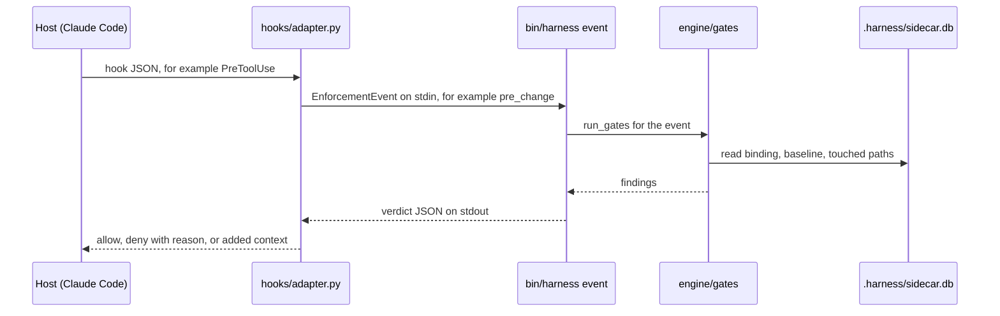

# Internals

This page is for contributors who change harness itself. The engine is plain Python 3.10 or later. It needs three packages: `pyyaml`, `tree-sitter` and `tree-sitter-language-pack`. The tree-sitter packages build the shadows. `harness doctor` reports the engine as not healthy when one of the three is missing.

## Engine layout

`bin/harness` is the entry point. It puts the plugin root on the import path and calls `engine.cli.main`. Each command family has one module under `engine/cli/`.

| Path | Responsibility |
|---|---|
| `engine/__init__.py` | shared helpers: config loading, defaults, substrate paths and `HarnessError` |
| `engine/events.py` | the event contract: event checks, findings, verdicts and the sidecar |
| `engine/findings.py` | the finding catalog `CATALOG` and the message helpers |
| `engine/gates/__init__.py` | `GateContext`, the builtin gate list, event selection and `exempt_paths` |
| `engine/gates/g1_manifest.py` | G1: the files that the bound slice needs exist |
| `engine/gates/g3_scope.py` | G3: touched files against the slice declaration and the non-goals |
| `engine/gates/g5_conformance.py` | G5: uses within declares, and no reimplementation |
| `engine/gates/g6_drift.py` | G6: changes to public symbols since the slice started |
| `engine/gates/g9_explore.py` | G9: production code does not import from `explore/` |
| `engine/gates/g10_shared_memory.py` | G10: agents never write `.claude/memory/shared/` |
| `engine/gates/extra.py` | loads and runs the repo-local gates from `gates.extra` |
| `engine/extractor/` | tree-sitter to shadows, in a lazy cache; module ids for namespace packages |
| `engine/review/` | the review stack: layer 0 facts, rubrics, ensemble and golden replay |
| `engine/resolver.py` | builds the slice context blocks under one cap |
| `engine/registry.py` | the registry of reusable modules, from `planned` to `built` |
| `engine/graph.py` | the append-only `edges.jsonl` and its git-notes mirror |
| `engine/baseline.py` | interface baselines, recovered from the slice's start commit |
| `engine/compiler.py` | `harness compile`: authored files to decision rows, non-goals and statements |
| `engine/docsections.py` | typed sections in the architect working document |
| `engine/explore.py` | explore: the toy, the decision cards and the statements |
| `engine/explore_adr.py` | `harness architect --from-explore`: frozen cards to ADRs and decision rows |
| `engine/statements.py` | statements and the test links that prove them |
| `engine/verification.py` | the red record, the pre-edit advisory and the close checks |
| `engine/permits.py` | the permit layer that approves, asks or denies a tool call |
| `engine/shared_memory.py` | shared memory: team facts that a human promoted |
| `engine/schema.py` | the row schemas of each substrate file |
| `engine/migrate.py` | schema migrations of the substrate |
| `engine/upgrade_010.py` | the 0.10 upgrade step registry and its runner |
| `engine/upgrade_w1.py` to `engine/upgrade_w6.py` | the upgrade steps of each workstream |
| `engine/upgrade_report.py` | the upgrade report: changed files, human checks and the commit proposal |
| `engine/lint_text.py` | the STE-80 text lint |
| `engine/context_cost.py` | the always-on context cost of each session |
| `engine/telemetry.py` | local event rows and the slice metrics row |
| `engine/overrides.py` | reads old overrides that use `deps:` ids |
| `engine/plugin_install.py` | reads host plugin listings and finds the installed engine |
| `engine/cli/__init__.py` | `build_parser()`, `COMMANDS` and `main` |
| `engine/cli/acceptance.py` | the configurable acceptance runner |
| `engine/cli/author.py` | architect, compile, author-gate, backlog and slice binding commands |
| `engine/cli/ceremony.py` | each check that a slice must pass to close |
| `engine/cli/close.py` | `harness close-slice` and `harness merge-slice` |
| `engine/cli/closure_state.py` | source and changed-file checks for close |
| `engine/cli/common.py` | helpers that more than one command uses |
| `engine/cli/explore.py` | `harness explore` and `harness explore --freeze` |
| `engine/cli/init.py` | `harness init`, the vendored engine and the CI workflow |
| `engine/cli/landing.py` | how a closed slice reaches the base branch |
| `engine/cli/review.py` | `harness review` and `harness adjudicate` |
| `engine/cli/slice.py` | `harness start`, `harness permit` and the bind checks |
| `engine/cli/substrate.py` | substrate read and write commands |
| `engine/cli/text.py` | `harness lint-text` |
| `engine/cli/upgrade.py` | project upgrades and host plugin upgrades |
| `engine/cli/verify.py` | `harness verify`, `harness doctor` and `harness event` |

Outside the engine, `hooks/` holds the Claude Code adapter, `adapters/` holds the other hosts, and `templates/` holds the files that init writes.

`tests/engine/test_cli_split.py` keeps the CLI small:

- `bin/harness` stays 40 lines or fewer.
- Each `engine/cli/*.py` module stays 500 lines or fewer. `engine/cli/acceptance.py` is at the limit, so a new feature there needs a new module.

## Event flow

Each host hook becomes one engine event, and each event gives one verdict.



- **Host to adapter to engine.** The adapter turns the host's hook JSON into an EnforcementEvent and runs `bin/harness event`.
- **Engine to gates and sidecar.** The engine selects the gates for the event, builtin and repo-local, and builds one `GateContext`. The gates read session state from the sidecar.
- **Back to the host.** The engine merges the findings into one verdict. The adapter turns it into the host's deny answer or added context.

For a shell command, the Claude Code adapter sends no event. It runs `harness permit`, which answers allow, ask, deny or defer. On defer, the host's own permissions decide.

## Verdicts and findings

A verdict holds three keys:

- `verdict`: `allow`, `allow_with_findings` or `block`.
- `findings`: the list of findings.
- `injections`: the context text for the host.

When several verdicts merge, the most restrictive one wins.

`make_finding(code, rule_ref, message, severity, layer, inject, precedents, key, fix)` in `engine/events.py` builds a finding. The severity is `gate`, `block` or `advisory`.

`validate_finding` rejects a finding that the engine must not emit:

- a block with no `rule_ref`;
- an unknown severity or an empty message;
- a `fix` that is set but empty.

Each code has an entry in `CATALOG` in `engine/findings.py`. `tests/engine/test_finding_contract.py` fails when a builtin code has no entry, or when a message has more than 25 words.

## Sidecar state

`.harness/sidecar.db` is a gitignored SQLite file. It holds three tables:

- `session_state`: the session bindings, the hashes of the injected blocks and the close attempts.
- `slice_snapshot`: the G6 baseline of the public symbols of each slice.
- `touched`: the paths that each session touched for each slice.

SQLite writes the `-wal` and `-shm` files beside it. Do not edit or commit them.

To delete the sidecar loses the session state. A slice in progress recovers its G6 baseline from its `started_at_commit`. A session must bind its slice again.

## Fail closed

- In a repo without `.harness/`, the hooks allow everything. The host's own permissions still decide.
- In an initialised repo, an engine error denies edits until you repair the substrate.
- The adapter imports no engine code and no package outside the standard library. So it can still deny when the engine cannot start.
- When the engine is down in pull request mode, the adapter also denies each command that could send code out.

## Tests

- `make test` runs `python3 -m pytest tests/ -q`.
- `tests/conftest.py` gives `build_toy_repo`, a toy repo with a real substrate, and the `toy` fixture. It also gives `run_cli`, which runs `bin/harness`, and `git`.
- `tests/adapter-conformance/` checks each host adapter. See [Other hosts](extending/hosts.md#conformance-tests).
- `tests/fixtures/` holds event samples, repo-local gate samples, the review golden set and a namespace-package repo.
- `tests/engine/test_docs_site.py` checks these pages: headings, STE-80 text, real command and skill names, and code facts.

## Change the engine

1. To add a builtin gate, add a module under `engine/gates/` with a docstring, a `GATE` dict and a `check(ctx)` function. Add it to `builtin_gates()`. Do not reuse a retired id: G2, G4, G7 or G8.
2. Add each new finding code to `CATALOG`, with its fix.
3. To add a CLI subcommand, add a parser in `build_parser()` and a handler in `COMMANDS`. Put the handler in the module of its command family.
4. When a change alters files in consumer repos, add an upgrade step. Call `register(Step(...))` in the workstream module, which `engine/upgrade_010.py` imports.
5. Change the hand-written pages in the same pull request. The build generates the Reference pages from the code.

An upgrade step has these parts:

- `describe(root)` lists the pending changes. After `apply`, it must return an empty list.
- `apply(root, ask)` makes the changes and returns report lines.
- `destructive=True` means that `apply` must call `ask` before it moves or deletes a file. The runner fails a step that does not ask.
- `advise(root)` returns `check:` lines for files that harness must not edit.

## Build the docs

```bash
pip install -r docs/requirements.txt
mkdocs serve
mkdocs build --strict
```

- `docs/hooks/reference.py` generates the Reference pages and the Changelog page from the code at build time. Change the code, not the generated page.
- `docs/internal/` holds design history: the specs, plans and design reviews. The site does not publish it.
- CI runs `harness lint-text` on the public pages.
